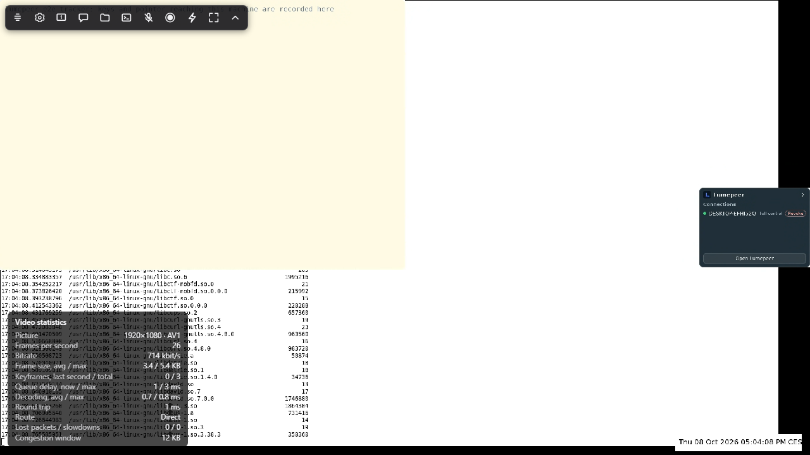

# Программный AV1 для хостов без аппаратного AV1-энкодера — этап 1 (замеры)

Дата: 2026-10-01. Ветка `research/software-av1`. Всё, что ниже, — замеры, кроме
мест, где прямо сказано «не проверено».

**Этап 2 (2026-10-02)** — libaom встроен в продукт по решению владельца:
раздел [«Этап 2: libaom в продукте»](#этап-2-libaom-в-продукте) в конце и
[ADR 0141](../adr/0141-a-host-with-no-hardware-encoder-encodes-av1-in-software.md).

**Закрытие (2026-10-08)** — оставшиеся пункты доделаны, раздел
[«Закрытие исследования»](#закрытие-исследования-2026-10-08) в конце. Две
ошибки в продукте, найденные по ходу: libaom в Windows-релизах v0.0.129–v0.0.135
собран без оптимизации и работает вдвое медленнее измеренного
([ADR 0146](../adr/0146-libaom-is-built-optimised-on-windows.md)), и замер
хоста принимал один медленный кадр за свой p95
([ADR 0145](../adr/0145-one-slow-frame-is-not-a-slow-host.md)).

## Итог

**Условие перехода к этапу 2 в строгом виде не выполнено, поэтому в продукт
ничего не встроено.** Ровно на одном пункте, времени кодирования, и с оговоркой,
которая, по-моему, меняет вывод (раздел «Пороги»).

| условие (beta, 1080p, рабочий стол, 30 fps)                     | порог            | лучший кандидат: libaom realtime, speed 10                                                                                                                                                                | openh264 в lumepeer сегодня | итог                              |
|-----------------------------------------------------------------|------------------|-----------------------------------------------------------------------------------------------------------------------------------------------------------------------------------------------------------|-----------------------------|-----------------------------------|
| время кадра p95 (BGRA→I420 + кодирование)                       | ≤ 16 мс          | **15.8** при 2 Мбит/с; 17.4 при 4; 20.0 при 8 (пресет «качество»); без конвертации 12.9 / 14.6 / 16.8                                                                                                     | 24.8–26.7                   | ✗ при 4–16 Мбит/с, на 1.4–4.6 мс |
| CPU                                                             | ≤ ~50% всех ядер | 1.1–1.2 ядра = **7%** от 16 потоков (игра: 2.3–3.2 ядра = 14–20%)                                                                                                                                         | 0.6–0.7 ядра                | ✓                                |
| экономия битрейта при равном качестве — или заметно чётче текст | ≥ 25%            | рабочий стол: **−61% PSNR-Y / −46% VMAF** против openh264 как есть; против openh264 без пропуска кадров −60% PSNR-Y, VMAF у потолка (−14%), на кропах чётче при битрейте на 30% ниже; игра: **−55% VMAF** | —                           | ✓                                |
| декодирование AV1 1080p у гостя класса beta, p95                | ≤ ~10 мс         | **beta, 2026-10-08**: программно p95 4.5–4.9 мс (рабочий стол) и 5.3–7.0 мс (игра) для потоков libaom; пока на beta работают VM VMware — 27–35 и 63–83 мс (см. «Декодирование AV1 у гостя»); на этом ПК 4.2 и 6.3 | —                           | ✓, если на машине не работают VM  |

Что показали замеры, по важности:

1. **Главная беда хоста без аппаратного энкодера — не кодек, а то, как lumepeer
   настроил openh264.** Режим скорости `RateControlMode::Quality` с включённым
   пропуском кадров (умолчания крейта, lumepeer их не трогает) выбрасывает кадры:
   на игре при 8 Мбит/с (пресет «качество») — **237 из 600 (40%)**, гость видит ~18
   fps вместо 30; при 2 Мбит/с — 62%. На рабочем столе при цели 1 Мбит/с — 36%,
   прокрутка превращается в рывки (VMAF прокрутки 60). Без пропуска кадров
   openh264 физически не укладывается в битрейт: на игре цель 2 Мбит/с даёт
   **11.5 Мбит/с**, 8 — 15.6; и не успевает: p50 26–29 мс, p95 47–72 мс уже на
   i7-11800H. То есть на играх openh264 держит 30 fps сегодня *только* за счёт
   выброшенных кадров. Хорошей настройки у него нет.
2. **Программный AV1 на beta быстрее нынешнего openh264, а не медленнее**:
   libaom s9/s10 — p50 10 мс, p95 16–21 мс, p99 20–27 мс против 22 / 25–27 / 33–48
   у openh264 на рабочем столе; на игре кодирует **каждый** кадр с p95 22–28 мс
   (SVT p11–13 — 20–32 мс), там где openh264 выбрасывает 40%.
3. **По эффективности AV1 выигрывает много**: см. таблицы BD-rate ниже. На игре
   все AV1-энкодеры экономят 41–58% против openh264 без пропусков (по всем трём
   метрикам), на рабочем столе libaom даёт +6–7 дБ PSNR-Y при равном битрейте
   против openh264 без пропусков (+9–10 дБ против openh264 как есть).
4. **Из двух библиотек годится libaom, не SVT-AV1** (в версиях 3.15.1 и 4.2.0):
   у SVT-AV1 инструменты экранного контента работают только на пресетах ≤ 8, а
   пресет 8 на beta — p95 35–37 мс; быстрые пресеты 11–13 плохо кодируют
   прокрутку текста (VMAF прокрутки 11–86 на 0.4–9 Мбит/с, BD-rate +78…+95%
   *хуже* openh264); а его самый быстрый режим (rtc + flat IPP) **падает**
   (segfault), когда контроль битрейта доходит до QP 0 — см. «SVT-AV1: падение».
5. Аппаратный MF AV1 этого ПК (Intel UHD) — самый экономный из всех (−71% на
   рабочем столе), но медленный: 25 мс на кадр 1080p, 50 мс на 1440p; и один раз
   упал с access violation внутри кода lumepeer/драйвера (см. «Побочные находки»).

**Моя рекомендация владельцу:** пересмотреть порог по времени (обоснование
ниже), достроить недостающий замер декодирования на beta и, если он пройдёт,
делать этап 2 с **libaom realtime, speed 10** (speed 9 как вариант для машин
мощнее) для 1080p при 30 fps. SVT-AV1 и rav1e — нет.

## Результаты

### Время кодирования на beta (Ryzen 7 5700U), 1080p30, реальное время


Время кадра = конвертация BGRA→I420 (на beta 2.7 мс p50, 3.4 мс p95 — одинаково
для всех) + кодирование. Все числа — по 900 (рабочий стол) и 600 (игра) кадрам
каждого прогона; «ядер» — процессорное время на секунду видео.

| энкодер                                         | рабочий стол p50 / p95 / p99, мс | ядер    | игра p50 / p95 / p99, мс | ядер    |
|-------------------------------------------------|----------------------------------|---------|--------------------------|---------|
| openh264, lumepeer как есть                     | 22 / 25–27 / 33–48               | 0.6–0.7 | 5–12 / **31–67** / 51–87 | 0.3–0.7 |
| libaom s10                                      | 10–11 / 16–21 / 21–27            | 1.1–1.2 | 18–24 / 22–27 / 24–30    | 2.3–3.2 |
| libaom s9                                       | 10–11 / 16–20 / 20–23            | 1.1–1.2 | 18–24 / 22–28 / 24–30    | 2.3–3.2 |
| libaom s8                                       | 12 / 19–25 / 25–29               | 1.4–1.5 | 21–28 / 25–76 / 27–229   | 2.7–5.0 |
| SVT-AV1 p13                                     | 12 / 17–25 / 20–36               | 0.75    | 16–26 / 20–30 / 22–35    | 0.9–1.3 |
| SVT-AV1 p11                                     | 12 / 18–25 / 22–35               | 0.8     | 18–27 / 22–32 / 23–37    | 1.0–1.5 |
| SVT-AV1 p8 (с инструментами экранного контента) | 17–19 / **35–37** / 47–59        | 1.3–1.5 | 26–45 / 38–69 / 40–315   | 2.4–5.0 |

Разброс внутри ячейки — по битрейтам 2–16 Мбит/с (больше битрейт — дольше
кодирование). Полные таблицы по всем прогонам — `software-av1/tables.md`.

На этом ПК (i7-11800H) всё быстрее в ~1.6 раза: libaom s9/s10 на рабочем столе
p95 10–15 мс, SVT p11–13 p95 12–19 мс, openh264 p95 18 мс; аппаратный MF H.264 —
p50 10 мс при 0.18 ядра.

### Качество и BD-rate


BD-rate — сколько битрейта нужно энкодеру для того же качества, что у эталона
(минус = меньше). Эталонов два: openh264 **как в lumepeer** (с пропуском кадров —
то, что видит гость сегодня) и openh264 **без пропуска кадров** (что дала бы
перенастройка без смены кодека).

| энкодер                | рабочий стол, против openh264 как есть: VMAF / PSNR-Y | рабочий стол, против openh264 без пропусков: VMAF / PSNR-Y / ΔPSNR при равном битрейте | игра, против openh264 без пропусков: VMAF / PSNR-Y / SSIM |
|------------------------|-------------------------------------------------------|----------------------------------------------------------------------------------------|-----------------------------------------------------------|
| libaom s8              | −51% / −66%                                           | −25% / −66% / +6.9 дБ                                                                  | −55% / −74% / −48%                                        |
| libaom s9              | −50% / −64%                                           | −19% / −64% / +6.2 дБ                                                                  | −54% / −74% / −48%                                        |
| libaom s10             | −46% / −61%                                           | −14% / −60% / +5.9 дБ                                                                  | −55% / −74% / −48%                                        |
| SVT-AV1 p8             | −53% / −55%                                           | −13% / −50% / +4.8 дБ                                                                  | −58% / −78% / −53%                                        |
| SVT-AV1 p10            | −30% / −12%                                           | +58% / +25% / −1.3 дБ                                                                  | −55% / −68% / −49%                                        |
| SVT-AV1 p11            | **+78% / +88%**                                       | хуже, кривые не пересекаются                                                           | −46% / −62% / −39%                                        |
| SVT-AV1 p13            | **+95% / +184%**                                      | хуже, кривые не пересекаются                                                           | −41% / −59% / −33%                                        |
| MF H.264 (аппаратный)  | +18% / +18%                                           | +93% / +24% / −1.7 дБ                                                                  | −55% / −72% / −50%                                        |
| MF AV1 (аппаратный)    | −71% / −70%                                           | −63% / −70% / +8.3 дБ                                                                  | −62% / −82% / −56%                                        |
| openh264 без пропусков | −14% / −4%                                            | —                                                                                      | —                                                         |

Как читать рабочий стол. Против openh264 как есть разница огромная, но это во
многом разница в выброшенных кадрах. Против openh264 без пропусков общий
диапазон VMAF — 94–97.7: на неподвижном тексте VMAF у потолка, и BD-rate по нему
и по SSIM (там расхождения в четвёртом знаке; у libaom вышло даже «+65…+87%»)
ничего не значит. PSNR-Y различает: libaom +6–7 дБ при равном битрейте. Поэтому
текст сравнивался на глаз — ниже.

На игре (CSGO) openh264 без пропусков вообще не опускается ниже ~11 Мбит/с, и
на его диапазоне 11–26 Мбит/с все AV1-энкодеры дают то же качество за 41–58%
битрейта. Против openh264 как есть BD-rate на игре −71…−82%, но там общий
диапазон качества узкий (VMAF до 72), число справочное.

### Текст: кропы

Прокрутка статьи Википедии, кадр 450, увеличение ×3 без сглаживания, около
0.7 Мбит/с (openh264 без пропусков ниже 1 Мбит/с не опускается):


- libaom s9 при 718 кбит/с ближе всех к оригиналу и чётче, чем openh264 при
  1015 кбит/с (у openh264 ещё артефакт прокрутки — призрачное подчёркивание под
  «AV»);
- SVT-AV1 p8 местами смазывает (вертикальные полосы у «AV1»), p10 — заметный шум
  вокруг букв;
- цветную окантовку ClearType теряют все: это 4:2:0, одинаково для H.264 и AV1.

Тот же кадр без увеличения, у openh264 как есть (664 кбит/с) — это **другой
кадр**: настоящий был выброшен, гость видит страницу на строку позади:


Неподвижный текст в редакторе при цели пресета «качество» (8 Мбит/с) у всех
практически одинаков; мелочи: у openh264 ряд точек над строкой, у SVT p11 —
«призрак» прежнего положения курсора:


### 1440p и 4K (только этот ПК)

Клипы с 4K-рабочего стола этого ПК (масштаб 250%): 1440p — уменьшенный, 4K —
исходный. На beta таких экранов нет; ниже — i7-11800H.

| энкодер           | 1440p: p50 / p95, мс | 1440p: битрейт, VMAF, VMAF прокрутки (цель 8 Мбит/с) | 4K: p50 / p95, мс (цель 16) |
|-------------------|----------------------|------------------------------------------------------|-----------------------------|
| openh264 как есть | 25 / **64–76**       | 1468 кбит/с, 95.0, 93.9                              | 52 / **79**                 |
| libaom s9 / s10   | 9 / 23–24            | 0.9–1.0 Мбит/с при любой цели, 93.0–93.1, **86**     | 19 / 39                     |
| libaom s8         | 13 / 25              | 3965 кбит/с, 93.7, 87.6                              | 25 / 47                     |
| SVT-AV1 p10       | 12 / 32              | 3396 кбит/с, 96.4, 95.0                              | 31 / 68                     |
| SVT-AV1 p11–13    | 12 / 21–25           | 3.4–3.5 Мбит/с, 89–90, 75–77                         | 29–30 / 49–56               |
| MF H.264          | 19 / 25              | 7726 кбит/с, 96.9, 96.6                              | 39 / 46                     |
| MF AV1            | 51 / 76–119          | 5574 кбит/с, 96.9, 96.4                              | 99 / 122                    |

- openh264 и на этом ПК не держит 30 fps на 1440p (p95 64–76 мс) и на 4K.
- libaom realtime на 1440p при speed 9/10 почти не тратит биты на неподвижный и
  прокручиваемый экран (~0.9 Мбит/с при любой цели, прокрутка VMAF 86): у него
  потолок качества на прокрутке выше 1080p, которого нет на 1080p. Это нужно
  разбирать отдельно, если идти дальше 1080p.
- 4K программным AV1 в реальном времени не тянет даже этот ПК (p95 39 мс у
  libaom). Выше 1440p — только аппаратный энкодер или уменьшение картинки.

### SVT-AV1: падение

SVT-AV1 4.2.0 в режиме `rtc` с плоской структурой IPPP (`hierarchical-levels
0`, самый быстрый режим реального времени) падает с segfault, когда контроль
битрейта доходит до qindex 0 — режима lossless в AV1. На этом ПК: **каждый**
прогон рабочего стола 2560×1440 в первые секунды и один прогон 1080p из ~50
(игра, 16 Мбит/с). Не зависит от числа потоков, пресета 9–13, темпа подачи, GOP,
режима экранного контента; исчезает с `min-qp 1` (6 из 6 повторов без падения)
и с иерархией по умолчанию (2 уровня — но она медленнее: p95 19–32 мс вместо
12–20 на этом ПК). В итоговых замерах SVT-AV1 — flat IPP с `min-qp 1`. Это баг
библиотеки, о нём стоит сообщить в SVT-AV1 (воспроизведение — `tools/codec-bench`,
клип 1440p рабочего стола, `--encoder svt --speed 11 --minq 0`).

### Декодирование AV1 у гостя

Страница `tools/codec-bench/decode-bench.html` декодирует потоки из прогонов
через WebCodecs так же, как гость lumepeer (`{ codec: 'av01.0.05M.08',
optimizeForLatency: true }`, без указания аппаратного ускорения), двумя способами:
по одному кадру с ожиданием картинки («последовательно») и в темпе 30 fps («в
реальном времени» — задержка от `decode()` до картинки, с очередью). Первый кадр
(запуск декодера) из процентилей исключён.

**Этот ПК** (Chrome 154 headless, тот же движок, что WebView2 154; i7-11800H),
в реальном времени, мс на кадр:

| поток                                   | аппаратно (по умолчанию) p50 / p95 | программно (dav1d) p50 / p95 / p99 |
|-----------------------------------------|------------------------------------|------------------------------------|
| рабочий стол 1080p, libaom s9, 4 Мбит/с | 0.5 / 1.4                          | 1.6 / 4.2 / 5.8                    |
| рабочий стол 1080p, SVT p11, 4 Мбит/с   | 0.5 / 0.9                          | 1.6 / 5.9 / 11.4                   |
| игра 1080p, libaom s9, 8 Мбит/с         | 0.6 / 1.5                          | 3.4 / 6.3 / 8.1                    |
| игра 1080p, SVT p11, 8 Мбит/с           | 0.6 / 1.5                          | 5.8 / **17.5** / 20.1              |
| рабочий стол 1440p, SVT p11, 8 Мбит/с   | 0.6 / 1.7                          | 1.7 / 6.5 / 16.9                   |
| рабочий стол 4K, SVT p11, 16 Мбит/с     | 0.7 / 1.9                          | 6.9 / 18.6 / 30.4                  |

Потоки libaom декодируются заметно дешевле потоков SVT-AV1 (на игре p95 6.3
против 17.5 мс). На этапе 1 я предполагал, что beta декодирует в ~1.6 раза
медленнее этого ПК (p95 ~7–10 мс). Замер 2026-10-08 этого не подтвердил:
свободная beta декодирует почти так же, как этот ПК.

**beta** (2026-10-08; Ryzen 7 5700U, Vega 8 / VCN 2.0). Аппаратного
AV1-декодера нет: `isConfigSupported` с `prefer-hardware` отвечает false, так
что «по умолчанию» здесь тоже программный декодер (dav1d). Замер шёл в headless
Edge 154.0.4258.62 (WebView2 той же версии), запущенном через `run-decode.ps1`
из задачи планировщика в сеансе пользователя. Для каждого состояния машины по
три прогона в реальном времени; в ячейках мс на кадр, разброс по прогонам:

| поток                                   | VM приостановлены: p50 / p95 / p99 | VM работают: p50 / p95 / p99 |
|-----------------------------------------|------------------------------------|------------------------------|
| рабочий стол 1080p, libaom s9, 4 Мбит/с | 2.2 / **4.5–4.8** / 5.7–6.1        | 3.1–3.5 / 28.9–33.0 / 41–56  |
| рабочий стол 1080p, SVT p11, 4 Мбит/с   | 2.5–3.0 / 5.7–6.6 / 9.0–9.6        | 3.7–4.0 / 34–38 / 58–77      |
| игра 1080p, libaom s9, 8 Мбит/с         | 4.1–4.7 / **5.4–7.0** / 6.9–18.8   | 5.0–5.3 / 72–83 / 106–135    |
| игра 1080p, SVT p11, 8 Мбит/с           | 8.2–9.1 / 11.5–16.3 / 14.6–28.0    | 9.4–10.2 / 148–193 / 184–279 |
| рабочий стол 1440p, SVT p11, 8 Мбит/с   | 2.7–3.1 / 9.5–11.6 / 21.0–23.6     | 3.4–4.0 / 20–77 / 56–153     |
| рабочий стол 4K, SVT p11, 16 Мбит/с     | 9.0–9.2 / 26.8–28.7 / 31.8–33.3    | 17–19 / 181–208 / 232–250    |

С `prefer-software` цифры те же: рабочий стол libaom p95 4.5–4.9 мс, игра
5.3–6.4 мс.

- **VM приостановлены**: прогоны 17:17, 17:23 и 17:29. В 13:46 beta
  перезагрузилась ради Windows Update, и VMware приостановил обе VM. Прогоны в
  17:23 и 17:29 целиком (и конец прогона в 17:17) шли рядом с живой сессией
  установленного клиента (аппаратный H.264), и на результат она не повлияла.
- **VM работают**: прогоны 11:53 и 12:00 (работала VM macOS, шла сессия
  установленного клиента, ждало установки обновление Windows) и прогон 17:49,
  после того как я вернул обе VM (macOS и Debian).

Вывод: на свободной beta программное декодирование 1080p потоков libaom
укладывается в порог ~10 мс с запасом (p95 4.5–7 мс). Работающие VM VMware на
той же машине поднимают p95 в 6–15 раз, а медиана при этом почти не меняется.
Значит, кадры стоят в очереди к процессору, а сам декодер не медленнее. В
последовательном режиме, без очереди, при работающих VM p95 4.7–11.8 мс. Гость
с работающими VM получит с программным AV1 рывки, которых у аппаратного
декодирования H.264 на той же машине может не быть; это не мерилось.

Почему на этапе 1 замера не было. В `run-decode.ps1` стояло
`-replace '\', '/'`, а `-replace` принимает регулярное выражение, и одиночный
`\` для него недопустим. Скрипт падал на этой строке, до запуска Edge, а задача
планировщика всё равно возвращала 0. Исправлено в `tools/codec-bench`
(`.Replace(...)` и `$ErrorActionPreference = 'Stop'`). Из семи прогонов
2026-10-08 один (12:06) за 15 минут не вывел ничего; его повторили. Все
прогоны — в `software-av1/decode-beta.json`.

Mac (WKWebView на Intel — нет аппаратного AV1) и Raspberry Pi: не проверены,
машины вне сети; для Mac готов `tools/codec-bench/decode-webkit-mac.swift`.

## Пороги

- **CPU ≤ 50% всех ядер** — слишком мягкий порог. На ноутбуке за 15 Вт половина
  ядер — это троттлинг и чужие кадры в играх у пользователя хоста. Разумнее
  «не больше двух ядер при 1080p30»: libaom s9/s10 укладывается (1.1–1.2 ядра на
  рабочем столе; на игре 2.3–3.2 — больше, и это надо держать в уме), SVT p11–13
  тоже (0.8 и 1.0–1.5).
- **p95 ≤ 16 мс (половина интервала кадра при 30 fps)** — я считаю его неверно
  выбранным эталоном. Он абсолютный, а сравнивать надо с тем, что хост делает
  сейчас: openh264 на beta — p95 25–27 мс и p99 до 48 мс, и при этом на играх
  выбрасывает 40% кадров. libaom s10 — p95 17.4–20.6 мс при 4–16 Мбит/с, p99
  21–27 мс, и кодирует каждый кадр. Переход на него *уменьшает* задержку на beta
  на 6–10 мс по p95 и на 7–24 мс по p99 при той же цели битрейта. Предлагаю порог: p95 не больше, чем у
  openh264 на той же машине, **и** не больше 2/3 интервала кадра (22 мс при 30
  fps) — запас под захват и отправку. Под ним libaom s10 проходит на всех
  битрейтах, SVT p11–13 — до 8 Мбит/с.
- Отдельно: из этих ~20 мс 2.7–3.4 мс — конвертация BGRA→I420 скалярным кодом
  крейта openh264, общая для всех кодеков. SIMD-конвертация (или на GPU) вернёт
  эти миллисекунды и openh264 тоже.
- **≥ 25% экономии** — порог нормальный; AV1 его проходит с запасом на игре и по
  PSNR на рабочем столе. Но на тексте VMAF и SSIM у потолка, поэтому для
  рабочего стола решать надо по PSNR и кропам, а не по VMAF.
- **60 fps** («баланс») и 144 («производительность»): на beta при 1080p не
  успевает никто из программных — ни openh264, ни AV1. Программный AV1 — только
  для пресета «качество» (30 fps).

## Побочные находки

- **lumepeer MF AV1 упал один раз** (0xC0000005, access violation) на этом ПК:
  рабочий стол, 500 кбит/с, полный прогон 900 кадров в реальном времени. Шесть
  повторов прошли. Это код, который уже работает у пользователей с аппаратным
  AV1 (`encode/windows.rs` + MFT Intel), его стоит разобрать отдельно.
- **Локальные сборки openh264 без ассемблера.** `openh264-sys2` молча собирается
  без SIMD, если не находит `nasm` (на этом ПК его не было): p50 54 мс, p95 150 мс
  на кадр 1080p вместо 14 / 18. Релизная сборка Windows (v0.0.118) ассемблер
  содержит — проверено поиском машинного кода в `lumepeer-desktop.exe`
  (`tools/codec-bench/find-openh264-asm.py`: 25 из 31 фрагмента; сборка с
  ассемблером — 31/31, без — 0/31). Linux/macOS-релизы не проверены.
- **Строка кодека AV1 у гостя** `av01.0.05M.08` означает уровень 3.1, а
  комментарий рядом в `view-decoder.ts` говорит про 4.1 (это `av01.0.09M.08`).
  Chromium уровень почти не проверяет, но для 1440p/4K 3.1 формально мало.
- rav1e 0.8.1 на speed 10 (пробный синтетический клип `testsrc2` 1080p): >200 мс
  на кадр и перерасход битрейта ×3 в low-latency — для реального времени не
  подходит, на реальных клипах не мерился.

## Что не проверено

- Декодирование AV1 на Mac (WKWebView, Intel) и Raspberry Pi. На beta оно
  измерено 2026-10-08 (см. «Декодирование»).
- Кодирование на Mac и Pi. Linux: только замер продукта при старте хоста в
  WSL на этом ПК (2026-10-08, «Закрытие исследования»), клипы там не гонялись.
- 60 fps и динамическая смена битрейта (ABR) — все прогоны при фиксированной цели.
- Живая сессия lumepeer с программным AV1 показана 2026-10-08 (Linux-хост в WSL
  этого ПК, гость — Windows), на beta — нет: «Закрытие исследования».

## Как мерили

### Материал

Записи экрана без потерь, без курсора (гость lumepeer рисует курсор сам):

| клип | откуда | размер | кадры | что внутри |
|---|---|---|---|---|
| desktop 1080p | реальный рабочий стол **beta** (1920×1080, масштаб 100%), Desktop Duplication через `ffmpeg ddagrab`, BGRA без сжатия | 1920×1080 | 900 (30 с при 30 fps) | 0–300: набор текста в редакторе (тёмная тема, Consolas 11); 300–600: прокрутка статьи Википедии про AV1 в Edge; 600–900: перетаскивание окна Edge поверх рабочего стола и окна VMware |
| game 1080p | Xiph `derf/twitch/CSGO` (y4m 1080p60, public domain), каждый второй кадр | 1920×1080 | 600 (20 с при 30 fps) | быстрый шутер от первого лица, текстуры, HUD |
| desktop 1440p | рабочий стол этого ПК (3840×2160, масштаб 250%), тот же сценарий, уменьшен в 1.5 раза фильтром `area` — так lumepeer уменьшает картинку хоста под окно гостя | 2560×1440 | 875 | те же три сегмента |
| desktop 4K | та же запись без уменьшения, с сегмента прокрутки | 3840×2160 | 575 | прокрутка + перетаскивание |

Сценарий — `tools/codec-bench/record-desktop.ps1`. Набор текста делает само окно
редактора (по таймеру добавляет символ раз в ~110 мс): Блокнот Windows 11
игнорирует синтетические нажатия (`SendInput` возвращает успех, символ не
появляется), а `SendKeys` из PowerShell 5 работает через journal hook, который
Windows 11 запрещает. Картинка на экране от этого не отличается от набора руками.
4K записан в `libx264rgb -qp 0` (математически без потерь): несжатый 4K30 — это
~1 ГБ/с, диск этого ПК пишет ~400 МБ/с.

Клипы лежат вне репозитория, в `C:\Users\beta_win\av1-research\clips`, в виде
записей без потерь: `beta-desktop\desktop-ffv1.mkv`, `csgo\csgo-ffv1.mkv`,
`pc4k\desktop-x264rgb.mkv`. Сырые `.bgra` для стенда (8–19 ГБ каждый)
восстанавливаются из них бит в бит, команды и md5 — в «Закрытии исследования».

### Энкодеры и настройки

Все программные энкодеры собраны из исходников с ассемблером (nasm 3.01) — так,
как их пришлось бы собирать в продукт. Настройки — максимально близко к тому, как
кодирует lumepeer: один проход, без lookahead и B-кадров, ключевой кадр только
первый, CBR, один кадр на входе — один пакет на выходе.

| имя в таблицах      | что это                                                                                                                                           | настройки                                                                                                                                                                                                                                                                                           |
|---------------------|---------------------------------------------------------------------------------------------------------------------------------------------------|-----------------------------------------------------------------------------------------------------------------------------------------------------------------------------------------------------------------------------------------------------------------------------------------------------|
| `openh264`          | **эталон**: код lumepeer, `lumepeer_media::encode::software::OpenH264Encoder` (openh264 0.9.8), BGRA на входе, его собственная конвертация в I420 | как в продукте: `ScreenContentRealTime`, `Complexity::Low`, потоков min(ядер, 4), `RateControlMode::Quality` (умолчание крейта), пропуск кадров включён (умолчание)                                                                                                                                 |
| `openh264-noasm`    | тот же код, openh264 собран без ассемблера                                                                                                        | см. «Побочные находки»                                                                                                                                                                                                                                                                              |
| `aom-s7`…`aom-s10`  | libaom 3.15.1, `AOM_USAGE_REALTIME`, `cpu-used` 7–10                                                                                              | настройки RTC из WebRTC (`libaom_av1_encoder.cc`): CBR, буфер 600/600/1000 мс, under/overshoot 50%, AQ 3 (cyclic refresh), CDEF, без TPL/order hint/OBMC/warped/global motion, `max-intra-bitrate-pct 300`; 8 потоков, 4 колонки тайлов, row-mt; для рабочего стола `tune-content=screen` + palette |
| `svt-p7`…`svt-p13`  | SVT-AV1 4.2.0, режим `rtc`                                                                                                                        | low delay (`pred-struct 1`), иерархия по умолчанию библиотеки (2 уровня — см. «SVT-AV1: падение»), CBR, буфер 600/600/1000 мс, lookahead 0, без TF и scene change, `lp 0` (потоки — авто); для рабочего стола `scm 1` (работает только на пресетах ≤ 8 — см. ниже)                                  |
| `mf-h264`, `mf-av1` | аппаратные энкодеры этого ПК через код lumepeer (`MediaFoundationEncoder`)                                                                        | как в продукте; только как ориентир                                                                                                                                                                                                                                                                 |
| rav1e 0.8.1         | speed 10, low latency                                                                                                                             | только справочно: на пробном синтетическом клипе (`testsrc2` 1080p) >200 мс на кадр, дальше не мерили                                                                                                                                                                                               |

Диапазон QP у всех AV1-энкодеров открыт полностью (0–63), как у openh264
(0–51): ограничение WebRTC `min-qp 10` не давало AV1 тратить больше ~2 Мбит/с на
рабочем столе, и кривые качества обрывались.

Все программные энкодеры получают одинаковые пиксели: BGRA → I420 тем же
конвертером, что у openh264 в lumepeer (`YUVBuffer::from_bgra8_source`, BT.601
limited). MF получает тот же I420, переложенный в NV12. Время конвертации входит
во «время кадра» у всех (у openh264 оно внутри его обёртки, как в продукте).

### Что меряет стенд

`tools/codec-bench` — отдельный Rust-проект вне workspace lumepeer. Кадры клипа
подаются **в реальном времени** (30 fps), чтение с диска — в отдельном потоке
наперёд, вне замера. На каждый кадр:

- **время кадра** = конвертация + `encode()` до готового пакета; p50/p95/p99/max
  по всем кадрам клипа, первый (ключевой) кадр — отдельно;
- **CPU** = процессорное время процесса за прогон минус время потока чтения,
  делённое на длительность прогона: «ядер занято» и «% от всех логических ядер»;
- размер каждого пакета, пропущенные кадры (openh264 пропускает их сам).

Качество (`tools/codec-bench/metrics.py`): битстрим декодируется ffmpeg
(dav1d для AV1), кадры выравниваются по исходным — пропущенный энкодером кадр
считается повтором предыдущего, как его и видит гость, — и сравниваются с тем
I420, который энкодеры получили на вход: VMAF 0.6.1 (среднее и 5% худших кадров),
PSNR-Y, SSIM. BD-rate — по Бьёнтегаарду (VCEG-M33): log-битрейт как кубика от
качества по огибающей точек, среднее по общему диапазону качества. Битрейт везде
**фактический**, а не заданный.

Энкодеры детерминированы: openh264 на этом ПК и на beta дал побайтно одинаковые
потоки, поэтому качество посчитано один раз по потокам этого ПК, а время и CPU
мерились на каждой машине.

### Машины

| машина   | CPU                                                                                     | роль                   |
|----------|-----------------------------------------------------------------------------------------|------------------------|
| этот ПК  | Intel i7-11800H, 8 ядер / 16 потоков, Windows 11                                        | качество, 1440p/4K, MF |
| **beta** | AMD Ryzen 7 5700U (Zen 2, 15 Вт), 8/16, Windows 11, без аппаратного энкодера в lumepeer | главная цель           |

Обе виртуальные машины на beta (Debian, macOS) на время замеров были
приостановлены через `vmrun suspend` (фон до этого — 15–20% CPU; после — 1–4%).
Во время второй серии замеров beta один раз перезагрузилась сама (часы при
загрузке ушли на 3 ч назад); серия к тому моменту уже закончилась.

Судьба VM после этапа 1 (проверено 2026-10-08). Скриптом их никто не
возобновлял: в `vm-control.log` после приостановки 2026-10-01 записей нет, задачи
`Av1Vmresume` не было. Утром 2026-10-08 VM macOS работала, VM Debian была
выключена (не приостановлена), к 13:46 работали обе. В 13:46 Windows Update
перезагрузил beta, и VMware при этом приостановил обе VM. В 17:36–17:47 я их
вернул. `vm-control.ps1 -Action resume` возобновил macOS и завис на ней:
скрипт перехватывает вывод `vmrun start` (`2>&1`), а открытое окно VMware
держит этот канал. Debian я вернул отдельным скриптом без перехвата вывода.
Итог: `vmrun list` показывает 2 работающие VM, файлов `.vmss` нет, betals-mac и
debian в Tailscale в сети.

## Как повторить

Всё лежит в `tools/codec-bench` (отдельный Cargo-проект, в workspace не входит):

1. nasm на PATH; libaom 3.15.1 и SVT-AV1 4.2.0 собрать из исходников статически
   (cmake, MSVC, `/MD`); пути — переменные `AOM_INCLUDE`, `AOM_LIB_DIR`,
   `SVT_INCLUDE`, `SVT_LIB_DIR` (см. `build.rs`). Скрипт этапа 1 —
   `C:\Users\beta_win\av1-research\build-libs.sh`; он ждёт исходники в
   `av1-research\src`, после уборки их надо скачать заново (теги `v3.15.1` и
   `v4.2.0`). Для одного libaom хватит сборки продукта:
   `cargo build --release --no-default-features --features lumepeer-aom` кладёт
   `aom.lib` и заголовки в `<target>\release\build\lumepeer-aom-sys-*\out\lib` и
   `out\include`. Это тот же релиз в варианте realtime-only, что и на этапе 1,
   и потоки совпадают побайтно (см. «Закрытие исследования»).
2. `cargo build --release --features mf` — стенд со всеми энкодерами;
   openh264 «как в сборке без nasm» — `OPENH264_NO_ASM=1 cargo build --release
   --no-default-features` в отдельный `CARGO_TARGET_DIR`.
3. `record-desktop.ps1 [-Output x264rgb] [-Browser chrome.exe]` — запись клипа в
   интерактивной сессии Windows-хоста.
4. `matrix.py --machine pc --clip desktop --clips <папка> --out runs-pc --run` —
   прогоны здесь; `--emit cmd` / `--emit sh` — скрипт для другой машины.
5. `codec-bench ref …` — эталонный I420; `metrics.py` — VMAF/PSNR/SSIM;
   `report.py` — таблицы (`software-av1/tables.md`) и графики; `crops.py` — кропы.
6. Декодирование: `make-decode-data.py` → `decode-bench.html` в браузере,
   `run-decode.ps1` (headless Edge), `decode-webkit-mac.swift` (WKWebView).
7. `find-openh264-asm.py <out-dir openh264-sys2 со сборки с nasm> <exe>` — есть
   ли в бинарнике ассемблер openh264.

Клипы, потоки и логи этого исследования лежат вне репозитория, в
`C:\Users\beta_win\av1-research`: `clips\` (записи `.mkv`), `runs-pc\`,
`runs-beta-final\` (beta: openh264 и libaom из первой серии, SVT-AV1 из
повторной), `runs-pc-lumepeer-aom*\` (2026-10-08), `crops\`, `decode\`,
`report-assets\`, `tables.md` и логи. Эталонные I420 (`refs\`) снова делает
`codec-bench ref …` (см. `metrics-all.sh`). Промежуточные прогоны SVT-AV1
(`min-qp 0` с падениями, иерархия по умолчанию) после 2026-10-08 не хранятся:
что они показали, записано в разделе «SVT-AV1: падение»; воспроизводятся
`codec-bench --encoder svt` с `--minq 0`.

## Этап 2: libaom в продукте

Дата: 2026-10-02. Решение и условия — [ADR 0141](../adr/0141-a-host-with-no-hardware-encoder-encodes-av1-in-software.md);
здесь — что сделано, что проверено и чем, и что осталось.

**Где делался этап 2.** Не на этом ПК и не на beta: в облачном Linux-контейнере
(Intel Xeon @ 2.80 GHz, 4 vCPU без SMT, Ubuntu 24.04). Tailscale там нет, beta
недоступна, сырых клипов (`C:\Users\beta_win\av1-research`) нет, Windows нет.
Поэтому всё, что требует beta, клипов или живой пары окон, не сделано — ниже
сказано, что именно и как это доделать.

### Что встроено

- `crates/aom-sys` (`lumepeer-aom-sys`): libaom **3.15.1** — тот же релиз, что
  мерился на этапе 1, — из официального tarball (SHA-256 в `VENDORED.md`),
  без тестов, документации, приложений и чужого кода, нужного только им.
  Собирается из исходников `cmake`-ом, статически, realtime-only, только
  энкодер. **Без nasm сборка падает** с объяснением; после configure
  проверяется, что в `aom_config.h` есть x86-64, SSE2…AVX2 и runtime CPU
  detection. C-шим — шим этапа 1, плюс `aom_shim_set_bitrate`
  (`aom_codec_enc_config_set`) и ошибки в буфер вместо stderr.
- `lumepeer-media`, фича `encode-aom` (по образцу `encode-openh264`, только
  x86-64 Windows/Linux, на остальных целях инертна): `encode::aom::AomEncoder`
  (`VideoEncoder`; пиксели через `Frame::as_cpu`; `request_keyframe`;
  `set_bitrate` без пересоздания энкодера и без ключевого кадра; размер
  меняется — новый энкодер с ключевого кадра) и `encode::software_av1` —
  готовность хоста и само измерение. `select_encoder` строит libaom для AV1
  без аппаратного AV1, если он собран и процессор с AVX2.
- `lumepeer-runtime`: `choose_media_codec` — условия ADR 0141; при смене
  пресета кодек выбирается заново, и если ответ изменился, медиапоток
  перезапускается (гость переподключает его сам, ~0.5 с «переподключения»);
  encode loop держит программный AV1 на 30 fps, заканчивает поток на кадре
  больше 1080p и следит за p95 (два окна по 90 кадров дольше 33 мс — AV1 off
  до перезапуска lumepeer).
- Строка кодека у гостя: `av01.0.09M.08` (уровень 4.1) вместо `av01.0.05M.08`
  (3.1).
- Релиз: `encode-aom` только в `windows-amd64` и `linux-amd64`; nasm ставится в
  обе строки; после сборки `ci/find-libaom-asm.py` ищет машинный код,
  собранный nasm, в `lumepeer-desktop(.exe)`. Лицензия libaom (BSD-2 +
  AOMedia Patent License 1.0) — в `deny.toml` рядом с openh264 и в `license`
  крейта (SBOM). Побочно: в Linux-строке релиза nasm не было никогда, т. е.
  **openh264 в Linux-релизах до сих пор собирался без ассемблера**; теперь — с
  ним.

### Цель битрейта и порог в продукте

- libaom получает **половину** H.264-цели сессии: «качество» 8 Мбит/с →
  4 Мбит/с AV1. Половина лежит внутри всех BD-rate этапа 1 (−46% VMAF / −61%
  PSNR-Y на рабочем столе, −55% на игре) и быстрее: на beta p95 17.4 мс вместо
  20.0 на рабочем столе и 23.2 вместо 25.2 на игре.
- Порог владельца (p95 ≤ openh264 на той же машине **и** ≤ 22 мс) хост
  проверяет сам, один раз за процесс, когда приходит первый гость, умеющий
  AV1: путь продукта (BGRA→I420 + libaom с настройками сессии) против
  openh264 продукта на синтетическом 1080p-«рабочем столе» в трёх актах
  записи этапа 1 — набор строки, прокрутка страницы, перетаскивание окна, —
  по 30 кадров на акт, в темпе 30 fps; ~6 с. Хост с аппаратным H.264 не
  мерится вовсе.

### Проверка

**Тот же поток, что у шима этапа 1.** Синтетический клип 1920×1080, 300 кадров
(100 — набор строки, 100 — прокрутка текста по 8 px/кадр, 100 — перетаскивание
окна с текстом), текст — отрендеренный шрифт DejaVu Sans Mono 15 px. Стенд
`codec-bench` собран дважды на **одной и той же** сборке libaom (той, что
строит `lumepeer-aom-sys`): `aom` (шим этапа 1, `--speed 10 --threads 4 --tiles 2
--minq 0 --maxq 63 --screen 1`) и новый `lumepeer-aom` (энкодер продукта как
есть). Продукт при цели сессии 2T даёт **побайтно тот же поток**, что `aom-s10`
при T:

|          | `aom-s10` @ T | `lumepeer-aom` @ 2T | md5                     |
|----------|---------------|---------------------|-------------------------|
| T = 2000 | 874.8 кбит/с  | 874.8 кбит/с        | совпадает (`14a86190…`) |
| T = 4000 | 937.3 кбит/с  | 937.3 кбит/с        | совпадает (`7c1438a3…`) |

Урезанная копия libaom и полный релиз (оба realtime-only) тоже дают побайтно
одинаковый поток. Realtime-only и полная сборка — **не** одинаковый (разница
0.6% в размере): какой из двух собирал этап 1, в отчёте не записано; продукт
собирает realtime-only, как WebRTC/Chrome.

**Время, эта VM** (p50 / p95 / p99 кадра, мс; 300 кадров в реальном времени;
разброс — по двум-трём повторам):

| энкодер                  | цель          | факт. кбит/с | p50       | p95       | p99   | ядер      |
|--------------------------|---------------|--------------|-----------|-----------|-------|-----------|
| `aom-s10` (шим этапа 1)  | 4000          | 937          | 13.7–14.4 | 24.6–25.5 | 29–32 | 1.03–1.06 |
| `lumepeer-aom` (продукт) | 8000 (→ 4000) | 937          | 14.0–15.7 | 24.0–28.4 | 28–35 | 1.04–1.09 |
| openh264 продукта        | 8000          | 810          | 25–26     | 36.1–39.6 | 44–45 | 0.74–0.76 |

По актам (`lumepeer-aom` @ 8000 / openh264 @ 8000, p50 / p95): набор 9.8 / 14.2
против 16.6 / 22.0; прокрутка 15.1 / 22.2 против 25.8 / 31.1; перетаскивание
23.4 / 29.4 против 33.1 / 46.8.

Продукт и шим в пределах шума друг друга, как и должно быть при одинаковом
потоке. Отношение этой VM к beta на рабочем столе одинаково для обоих
энкодеров: AV1 ~25 / 17.4 ≈ 1.45, openh264 ~38 / 25.9 ≈ 1.47 — синтетический
клип по тяжести близок к записанному, а VM примерно в 1.45 раза медленнее beta.

**Измерение продукта на этой VM** (`measures_this_host`, итоговая версия, три
прогона): AV1 p95 21.7 / 22.3 / 22.4 мс, openh264 45.3–53.1 мс → «готов» в
одном прогоне из трёх. Оно мягче отрендеренного клипа на 2–4 мс (24–28 мс):
мой синтетический текст проще шрифта. Первая версия измерения (только
прокрутка) давала 17.3 мс — на 8–10 мс мягче; поэтому измерение переделано на
три акта. Остаток расхождения записан в ADR 0141 как открытый вопрос.

**Тесты.** `lumepeer-media` (`encode::aom`, `encode::software_av1`,
`select_encoder`), `lumepeer-runtime`: каждая ветка `choose_media_codec` /
`software_av1_refusal` (нет AV1 у гостя; аппаратный AV1; каждая причина отказа
хоста; 30 / 31 / 60 / 144 fps; 1920×1080, 1080×1920, 1920×1200, 1440p, 4K;
пресет и размер ещё неизвестны), сторож encode loop; и сквозной тест с
настоящим libaom: хост и гость-актёры в одном процессе, гость умеет AV1 —
поток AV1 с ключевым кадром и sequence header на «качестве», на 60 fps поток
перезапускается в H.264, обратно на 30 — снова AV1. Плюс `error_matrix` и
`view-decoder.test.ts`. clippy `-D warnings` чист для `lumepeer-core`,
`lumepeer-aom-sys`, `lumepeer-media` (без фич, `capture-x11,encode-openh264`,
вся Linux-сборка с `encode-aom`) и `lumepeer-runtime` (с `encode-aom` и без).
Сборка без nasm падает (`NASM=/nonexistent/nasm` → «nasm not found …»);
`ci/find-libaom-asm.py` находит код всех шести обязательных объектов nasm в
бинарнике с libaom и ни одного — в бинарнике без него. Полные прогоны:
`lumepeer-core` 166/166, `lumepeer-media` 91/91 (с `encode-aom` — 104/104),
`error_matrix` 17/17, `media_pipeline` 7/7, `lumepeer-runtime` 310 из 312
(с `encode-aom` — 311 из 313): два терминальных теста
(`a_granted_shell_runs_and_a_revoke_closes_it_and_refuses_the_next`,
`a_closed_window_beside_ends_its_shells_and_not_the_session`) в этом
контейнере падают и на чистом master — шелл не открывается; к этапу 2
отношения не имеют.

**Оверлей статистики гостя** (Ctrl+Alt+Shift+S) показывает кодек (`AV1`), fps
и время *декодирования*; время *кодирования* — на хосте, в логе: каждые 90
кадров программного AV1 — «software AV1 frame time (scale and encode, p95)»,
каждые 5 с — «media: the last period of the encode loop» с `encode_ms`
(среднее/макс.). Протокола, который нёс бы его гостю, нет. С ADR 0143 первая из
этих строк пишется только тогда, когда AV1 выбрал сам хост: при кодировщике,
выбранном гостем, сторож AV1 выключен (`chosen_av1 = software_av1 &&
!control.encoder_pinned()` в `view.rs`), и время кодирования видно только во
второй строке.

### Не сделано и почему

Раздел написан 2026-10-02, переписан 2026-10-08 по коду, `git log`, логу клиента
beta и замерам этого дня. Четыре пункта, которые оставались 2026-10-02:

- **VM на beta** возобновлены 2026-10-08, обе работают (см. «Машины»).
- **Декодирование на beta** измерено 2026-10-08 (см. «Декодирование AV1 у
  гостя»). На свободной машине p95 составляет 4.5–7 мс для потоков libaom, при
  работающих VM VMware 27–83 мс.
- **Почему lumepeer не видел на beta аппаратный H.264**, выяснено в ADR 0144
  (v0.0.135). Два `AMDh264Encoder` отказывали пробе 64×64 в `SetOutputType`
  (`MF_E_INVALIDMEDIATYPE`), а 128×128 и больше принимали. Теперь проба 256×256.
  В логе клиента beta на v0.0.135, 2026-10-08 в 08:44:26Z и 14:20:31Z: «hardware
  H.264 encoder found: software AV1 is not for this host (ADR 0141)». Значит,
  сама beta программный AV1 больше не выбирает; получить его там можно только
  выбором кодировщика в панели гостя (ADR 0143).
- **Путь продукта на beta** мерил сам продукт, каждый раз при старте или первом
  госте. Строки лога клиента (`%LOCALAPPDATA%\io.insigmo.lumepeer\logs`):

  | время, UTC | версия | «software AV1 measured on this host» | итог |
  |---|---|---|---|
  | 2026-10-03 10:30 | v0.0.129–130 | AV1 26.3, openh264 27.8 мс, `budget_ms=22` | не готов: бюджет 22 мс (до ADR 0142) |
  | 2026-10-03 10:52 | v0.0.130–131 | 27.2 / 27.7 мс, `budget_ms=22` | то же |
  | 2026-10-03 11:40 | v0.0.132 | 28.5 / 26.3 мс, `budget_ms=33` | не готов: AV1 медленнее openh264 |
  | 2026-10-07 20:32 | v0.0.133 | 262.9 / 67.3 мс | на beta шёл фильм (прогон ADR 0144); 262.9 — один кадр, ADR 0145 |
  | 2026-10-07 22:33 | v0.0.133–134 | 251.8 / 284.7 мс | то же, оба числа — по одному кадру |
  | 2026-10-08 08:44, 14:20 | v0.0.135 | не мерил: «hardware H.264 encoder found» | ADR 0144 |

  Строку «28.5 / 26.3» ADR 0143 цитирует 2026-10-05, но записана она
  2026-10-03 в 11:40Z, через 19 минут после выхода v0.0.132. И главное: все эти
  числа сняты с libaom, собранного без оптимизации (ADR 0146). Исправленный
  libaom на beta ещё не мерился. beta с аппаратным H.264 замер при старте не
  запускает, а остановить установленный клиент, чтобы запустить сборку без
  `encode-mf`, было нельзя (ниже). Есть цифры с исправленным libaom на других
  машинах: этот ПК (Windows, i7-11800H, занят программами владельца) — AV1 12.8
  мс против openh264 25.1 мс; Linux в WSL на этом же ПК — 8.2–9.2 против
  20.1–24.5 мс (пять запусков).

Что осталось несделанным:

- **Живое окно с AV1 от beta.** Весь день 2026-10-08 к установленному клиенту
  beta были подключены доверенные устройства владельца: с 08:44 до перезагрузки
  в 13:46 и снова с 17:20. Установленный клиент держит роль хоста (именованный
  мьютекс, ADR 0085 §4; уступает его только хост экрана входа). Поэтому
  e2e-сборка рядом с ним отвечает `NOT_THE_HOST`, а его остановка оборвала бы
  сессию владельца. Окно показано на Linux-хосте в WSL этого ПК (см. «Закрытие
  исследования»). На beta это стоит повторить, когда к ней никто не подключён,
  и уже со сборкой, где есть ADR 0146. Выбор кодировщика в панели гостя
  (ADR 0143) даст там AV1 и на v0.0.135, но строк «software AV1 frame time» в
  этом режиме нет, а libaom там неоптимизированный.
- **Декодирование на Mac и Raspberry Pi** не мерилось (не входило в эту задачу).
- **libopus** (`opusic-sys`) собирается тем же крейтом `cmake`, и на Windows,
  вероятно, тоже без оптимизации. Не проверено; это вынесено в отдельную задачу.
- Мелочь: процесс, который не стал хостом (`NOT_THE_HOST`: e2e-гость рядом с
  установленным клиентом на этом ПК), тоже мерит программный AV1 при старте
  (ADR 0143) и тратит на это ~5 с процессора впустую. Не исправлялось.

### После слияния с master (2026-10-03)

Ветку на GitHub кто-то удалил, а в master тем временем пришли латентность
(ADR 0139: подтверждения кадров, уменьшение на GPU) и автозапуск Windows
(ADR 0140). ADR программного AV1 перенумерован в **0141**, master влит в
ветку. Конфликт был один, механический: обе стороны добавили поля в
`EncodeControl`. Ревью слияния, где каждую находку проверял скептик, нашло в
моём коде три настоящие ошибки. Все исправлены, на каждую есть тест, и каждый
тест падает без своего исправления:

- `lumepeer-aom-sys` — член workspace, и `cargo build --workspace` на macOS,
  ARM или без nasm падал в его build.rs. Теперь сборка libaom — фича
  `vendored`, её включает `encode-aom`; без неё build.rs ничего не делает
  (проверено: x86-64 Linux без nasm, Windows, aarch64).
- Защита «экран больше 1080p» выбрасывала первый кадр, а захват отдаёт кадры
  только при изменениях. Поэтому поток H.264 после переподключения на
  неподвижном экране ничего не показывал, пока на хосте что-то не сдвинется.
  То же было после перезапуска по смене пресета. Теперь: (1) размер экрана
  берётся из режима дисплея в начале цикла, и лишний поток AV1 кончается, не
  взяв ни одного кадра; (2) каждый новый цикл берёт снимок экрана как есть
  (`ScreenCapturer::snapshot`) и кодирует его первым. У Wayland/PipeWire
  такого нет: это записано как ограничение.
- Размер экрана терялся после второго переподключения, и пресет «качество»
  мог зря перевести экран 1440p в AV1. Теперь новый поток наследует размер
  предыдущего.

Прогон после исправлений: `lumepeer-media` 94/94 (с `encode-aom` — 107/107),
захват под Xvfb 43/43, `error_matrix` 17/17, `media_pipeline` 7/7,
`lumepeer-runtime` 317 из 319 (с `encode-aom` — 322 из 324; падают те же два
терминальных теста, что и на чистом master). clippy `-D warnings` чист в
восьми конфигурациях, включая кросс-проверку Windows-захвата
(`--target x86_64-pc-windows-msvc`).

### Второе ревью — уже самих исправлений

Второе ревью, тоже со скептиками, подтвердило три проблемы. У двух общий
источник: `refresh` клал снимок в общий захват, а забирал его следующий опрос.

- **Windows, secure desktop.** `refresh` заставлял взять GDI-снимок с
  дубликации, которую между двумя циклами никто не опрашивал. Если за эти
  полсекунды экран блокировали или появлялся UAC, BitBlt падал, и цикл
  заканчивался с «capture ended». Путь secure desktop (ADR 0049) не
  срабатывал, и так повторялось на каждом переподключении, пока экран
  заблокирован.
- **Несколько зрителей.** Снимок доставался циклу того зрителя, который
  опросил первым. Ему уходил лишний кадр, а на zero-copy пути Windows это ещё
  и две пересборки MF-кодировщика. Зритель, который просил снимок, всё равно
  ничего не получал.
- **X11, режим больше захвата.** Найдено, но скептиками не проверено;
  подтверждено по коду и тестом. Режим дисплея на X11 — это режим CRTC. При
  `xrandr --scale` или `--setmonitor` он больше захватываемой области, и
  проверка до захвата обрывала каждый поток AV1 экрана 1080p.

Исправления:

- `refresh` заменён на `ScreenCapturer::snapshot() -> Option<Frame>`. Снимок
  возвращается тому циклу, который его попросил, считается доставленным и
  кодируется первым кадром.
- Windows сначала опрашивает дубликацию без ожидания (`AcquireNextFrame(0)`):
  - `ACCESS_LOST` запускает восстановление secure desktop, как это делает
    обычный опрос;
  - ожидающий present отдаётся как кадр;
  - GDI берётся только если present'а нет.

  Любая другая ошибка снимка цикл не заканчивает: с ней разберётся первый
  опрос.
- Режим дисплея записывается как размер только пока ни один кадр не сообщил
  свой.
- Тесты:
  - число отданных захватом картинок показывает, что поток AV1 для 1440p
    кончается, не взяв ни одной;
  - новый тест на режим 4K при захвате 1080p;
  - тест «Wayland» переименован: он моделирует захват без режима, но со
    снимком.

  Оба теста падают без своих исправлений. Windows-код проверен кросс-clippy,
  запустить его здесь негде.

Прогон: `lumepeer-media` 94/94 (с `encode-aom` — 107/107), захват под Xvfb
49/49, `error_matrix` 17/17, `media_pipeline` 7/7, `resource_budget` 1/1,
`lumepeer-runtime` 317 из 319 (с `encode-aom` — 324 из 326; падают те же два
терминальных теста).

### Пороги: стоп-условие

**2026-10-02, облачная VM этапа 2 (Linux).** Путь продукта на синтетическом
«рабочем столе» дал p95 24–28 мс при тогдашнем пороге 22 мс, в 1.4–1.6 раза
быстрее openh264 (36–40 мс). Замер продукта на ней показывал 21.7–22.4 мс и
пропускал машину примерно в одном случае из трёх. На Linux libaom собирается
с оптимизацией (ADR 0146 касается только MSVC), так что эти числа верны.

**Сейчас (2026-10-08).**

- Порог: p95 не хуже, чем у openh264 на той же машине, и не больше 33 мс
  (ADR 0142). Замер идёт через 10 с после старта хоста (ADR 0143), а раньше
  срока он останавливается, только когда уже сам p95 не меньше 250 мс
  (ADR 0145). С таким порогом облачная VM этапа 2 прошла бы.
- beta. Продукт мерил её пять раз: AV1 26.3–28.5 мс против openh264
  26.3–27.8 мс, почти ничья, на которой построен ADR 0143. Но все пять
  замеров шли на libaom без оптимизации, а на этом ПК такой libaom почти вдвое
  медленнее исправленного на записанном рабочем столе (p50 13.2–14.3 против
  6.8–6.9 мс, p95 33–44 против 11–16 мс). Объяснение ADR 0142 («синтетический
  экран тяжелее записи», 23–25 мс против 17.4 мс этапа 1) поэтому не нужно:
  разница из-за сборки, а не из-за экрана. С исправленным libaom beta по замеру
  продукта не мерилась. Если масштабировать по этому ПК, ожидаю на ней около
  половины прежних 26–28 мс, то есть порог с запасом. Это оценка, не замер.
- На практике beta с v0.0.135 сама AV1 не выбирает: у неё теперь есть
  аппаратный H.264 (ADR 0144). Стоп-условие касается хостов без аппаратного
  энкодера: Linux-хоста без VA-API (в WSL этого ПК AV1 8.2–9.2 мс против openh264
  20.1–24.5, готов) и Windows-машин без аппаратного H.264 (этот ПК в сборке без
  `encode-mf`: 12.8 против 25.1 мс, готов).


## Закрытие исследования (2026-10-08)

Сделано на этом ПК (i7-11800H) и на beta, по коду master `07fe8e6` (v0.0.135)
и логам. Перед работой я сверил, что уже сделано: ADR 0141 вошёл в релиз
v0.0.129 (`encode-aom` в релизной сборке с `c8c2521`), ADR 0142 — в v0.0.132
(`88cb12d`), ADR 0143 — в v0.0.133 (`7bb7009`), ADR 0144 — в v0.0.135
(`a6c17e8`). Строки лога beta — в таблице раздела «Не сделано и почему».

### Клипы этапа 1: продукт против `aom-s10`

Стенд собран дважды с nasm 3.02 из `C:\Users\beta_win\AppData\Local\bin\NASM`
в начале PATH: `--no-default-features --features lumepeer-aom` (энкодер
продукта на libaom, который собирает `lumepeer-aom-sys`) и
`--no-default-features --features aom` (шим этапа 1 на сборке libaom этапа 1:
`AOM_INCLUDE=av1-research\src\aom`, `AOM_LIB_DIR=av1-research\build\aom\Release`).
Прогон:

```text
matrix.py --machine pc --clip desktop --only lumepeer-aom,aom-s10
          --clips C:\Users\beta_win\av1-research\clips --bin <aom> --bin-lumepeer <lumepeer-aom> --run
```

Записанный рабочий стол beta 1080p, 900 кадров в реальном времени. libaom
получает 2, 4, 8 и 16 Мбит/с, `lumepeer-aom` при этом получает вдвое больше,
как цель сессии.

**Потоки побайтно одинаковые** на всех четырёх битрейтах и во всех сборках:
у этапа 1, у нового `aom-s10`, у `lumepeer-aom` до исправления и после. md5:
`eccbe76c…`, `2ede5598…`, `35cf164e…`, `0ca6dded…`. Значит, этап 1 собирал
libaom в варианте realtime-only (это подтверждает и `build-libs.sh`:
`-DCONFIG_REALTIME_ONLY=1`).

**Время совпало не сразу:**

| сборка, время прогона 2026-10-08                          | p50, мс   | p95, мс   | p99, мс   | ядер      | опоздавших из 900 |
|-----------------------------------------------------------|-----------|-----------|-----------|-----------|-------------------|
| `aom-s10` этапа 1 (2026-10-01)                            | 5.8–6.2   | 10.2–14.5 | 15.3–18.4 | 0.56–0.71 | 0                 |
| `aom-s10`, 10:55                                          | 6.5–6.7   | 12.6–15.1 | 17.2–21.2 | 0.59–0.69 | 0–3               |
| `lumepeer-aom`, как в релизах v0.0.129–v0.0.135, 10:55    | 13.2–14.3 | 33.3–43.9 | 48.5–61.9 | 1.75–1.97 | 24–207            |
| `lumepeer-aom` с ADR 0146, 11:07                          | 6.8–6.9   | 11.4–16.0 | 17.5–21.3 | 0.59–0.73 | 0                 |
| ПК занят программами владельца (35–42% CPU), 16:17: `aom-s10` | 10.7–11.5 | 18.5–22.9 | 23.5–29.9 | 0.94–1.15 | 0             |
| то же, `lumepeer-aom` с ADR 0146                          | 11.1–12.2 | 19.5–23.7 | 27.6–28.9 | 0.99–1.12 | 0–1               |

Продукт при том же потоке тратил втрое больше процессора. Причина в сборке:
крейт `cmake` с MSVC и генератором Visual Studio подменяет
`CMAKE_C_FLAGS_RELEASE` и теряет `/O2 /Ob2 /DNDEBUG`. libaom в Windows-релизах
скомпилирован без оптимизации и с включёнными assert. Исправление и
доказательство — [ADR 0146](../adr/0146-libaom-is-built-optimised-on-windows.md);
`check_optimised` в `crates/aom-sys/build.rs` теперь останавливает такую сборку.
После исправления продукт и шим этапа 1 в пределах шума друг от друга, и на
свободном ПК, и на занятом. В серии 11:07 у `aom-s10` на 8 Мбит/с p50 вышел
14.0 мс при 6–7 у остальных: прогон чем-то сбит, повтор в 16:17 (обе сборки
рядом) это показывает. Все числа и md5 — `software-av1/lumepeer-aom-clips-pc.json`.

Шим этапа 1, собранный против libaom из сборки продукта с ADR 0146
(`out\include` и `out\lib` крейта `lumepeer-aom-sys`), на 4 Мбит/с даёт тот же
поток (`2ede5598…`) и то же время, что этап 1: p50 6.0, p95 11.8 мс, 0.59 ядра.
Так что для повторения замеров libaom этапа 1 хранить не нужно.

### Замер хоста: один медленный кадр

На beta 2026-10-07 продукт записал «p95» 262.9, 251.8 и 284.7 мс. Каждое из этих
чисел — время одного кадра: замер останавливался на первом кадре длиннее
250 мс, даже во время прогрева, и отдавал этот кадр как p95. Исправление —
[ADR 0145](../adr/0145-one-slow-frame-is-not-a-slow-host.md): раньше срока
замер останавливается, только когда пять из 90 кадров уже не короче 250 мс
(p95 из 90 кадров — пятый с конца, так что после этого он не меньше 250 мс). Тесты `one_slow_frame_does_not_end_the_measurement` и
`a_hopeless_p95_ends_the_measurement_at_once`.

Проверка обоих исправлений: `cargo test -p lumepeer-media --lib software_av1`
без фич и с `encode-aom` — 8 из 8 (и 1 пропущенный, замер машины);
`cargo clippy -p lumepeer-media -p lumepeer-aom-sys --all-targets -- -D warnings`
с `encode-aom` и без — чисто.

### Живое окно с программным AV1

**Какой путь работает, по коду.** Строки «software AV1 frame time» пишет
только сторож AV1, а он включён, только если AV1 выбрал сам хост:
`chosen_av1 = software_av1 && !control.encoder_pinned()` в `view.rs`. Сам хост
выбирает AV1 при четырёх условиях (`software_av1_refusal`, `readiness`): у
него нет аппаратного H.264, замер при старте прошёл, пресет не выше 30 fps, и
захватываемый экран не больше 1080p. Отсюда:

- beta с v0.0.135 нашла аппаратный H.264 (`Readiness::HardwareEncoder`), так что
  AV1 там бывает только по выбору гостя, а тогда нет строк «software AV1 frame
  time». Сборка без `encode-mf` на beta потребовала бы остановить установленный
  клиент, а к нему весь день были подключены доверенные устройства владельца
  (см. «Не сделано и почему»).
- Этот ПК не годится по двум причинам: экран 3840×2160, так что хост откажется
  от AV1 из-за размера (`PictureSize`), и роль хоста держит установленный
  клиент (`NOT_THE_HOST`).
- Подошёл Linux-хост: аппаратного энкодера у него в lumepeer нет без VA-API, а
  экран можно задать. Это WSL Debian на этом ПК. Сборка — release с
  `-C debug-assertions=yes` (иначе нет pilot), фичи
  `pilot,tauri/custom-protocol,capture-x11,encode-openh264,encode-aom,decode-openh264`.
  Экран — Xvfb 1920×1080 с прокручивающимся xterm и часами. Гость — e2e-сборка
  Windows (без `encode-mf`, с ADR 0145/0146) на этом ПК рядом с установленным
  клиентом. Обоими управлял `e2e/matrix/harness.py` (приглашение, разрешение,
  pilot).

**Результат** (2026-10-08, 17:02–17:04 по времени этого ПК):

- хост при старте: «software AV1 measured on this host … software AV1 p95
  9.2 ms, openh264 p95 24.5 ms budget_ms=33 ready=true» (за пять запусков AV1
  8.2–9.2 мс, openh264 20.1–24.5 мс);
- выбор: «no hardware AV1 encoder: encoding AV1 in software (ADR 0141)»,
  «video codec negotiated codec=Av1 encoder=Auto»;
- цикл кодирования каждые 5 с: `encoder=SoftwareAv1 codec=Av1 width=1920
  height=1080 fps=25`, 602–761 кбит/с, `encode_ms` 4.9–5.2 в среднем и 6.6–9.0
  максимум, захват 5.1–5.4 мс;
- **«software AV1 frame time (scale and encode, p95)»** каждые 90 кадров:
  5.9–6.8 мс, больше 20 строк за полторы минуты;
- оверлей гостя (Ctrl+Alt+Shift+S; включён тем же событием `keydown` на
  документе окна, которое ловит обработчик горячей клавиши): «1920×1080 · AV1»,
  25–26 кадров/с, 611–1236 кбит/с, кадр 2.9–5.8 КБ в среднем, декодирование
  0.7–0.9 мс в среднем (максимум один раз 32.1 мс), RTT 1 мс, маршрут прямой.



Снимок окна гостя сделан через pilot, это рендер страницы вместе с canvas.
Между снимками в 17:03:07 и 17:04:08 в xterm на хосте прокрутились строки и
сменилось время на часах. Картинка движется.

Ловушки стенда, не продукта:

- Xvfb в WSL не может создать сокет в `/tmp/.X11-unix`: каталог принадлежит
  WSLg. Тогда GTK подключается через абстрактный сокет, а захват lumepeer
  получает «cannot connect to the X server: Connection refused». Помогает tmpfs
  поверх `/tmp/.X11-unix` со ссылкой на `X0` WSLg.
- X-клиенты, запущенные без `setsid`, умирали вместе с вызовом `wsl`. Экран
  стоял, а захват X11 отдаёт кадры только при изменениях, поэтому после двух
  ключевых кадров было 0 fps. С `setsid` всё пошло.

### Что остаётся в `C:\Users\beta_win\av1-research`

После уборки (команды — у владельца) остаётся то, на что ссылается этот
документ:

- `clips\beta-desktop\desktop-ffv1.mkv`, `clips\csgo\csgo-ffv1.mkv`,
  `clips\pc4k\desktop-x264rgb.mkv` — исходники всех клипов, сжатые без потерь,
  плюс миниатюры. Сырые `.bgra`, на которых работает стенд, восстанавливаются
  из них бит в бит (проверено по md5 2026-10-08, ffmpeg 9.0):

  ```text
  ffmpeg -i clips\beta-desktop\desktop-ffv1.mkv -f rawvideo -pix_fmt bgra clips\desktop.bgra       (md5 0664e51456a28af6a7f6bbf463fb5f7e)
  ffmpeg -i clips\csgo\csgo-ffv1.mkv -f rawvideo -pix_fmt bgra clips\csgo.bgra                     (md5 50d193755d53f06d53f25fd9ca73d135)
  ffmpeg -i clips\pc4k\desktop-x264rgb.mkv -vf scale=2560:1440:flags=area -fps_mode cfr -r 30 -f rawvideo -pix_fmt bgra clips\desktop1440.bgra   (md5 d22c552128058d27ff632222429b63d0)
  ffmpeg -ss 11.7 -i clips\pc4k\desktop-x264rgb.mkv -frames:v 575 -f rawvideo -pix_fmt bgra clips\desktop4k.bgra   (md5 0572ce6e22a6a86d9bbed67c7112b579; 575 кадров совпали покадрово)
  ```

  `clips\csgo\CSGO-head.y4m` (исходник игрового клипа) — публичный файл Xiph
  `derf/twitch/CSGO`, его можно скачать заново.
- `runs-pc\` — потоки и метрики качества этапа 1 по всем клипам;
  `runs-beta-final\` — время на beta; `runs-pc-lumepeer-aom\`,
  `runs-pc-lumepeer-aom-fixed\`, `runs-pc-lumepeer-aom-fixed2\` — прогоны этого
  раздела.
- `crops\`, `decode\` (страница и данные декодирования, результат этого ПК),
  `report-assets\`, `tables.md`, `metrics.log`, `metrics2.log`, скрипты
  (`build-libs.sh`, `metrics-all.sh`, `run-beta*.cmd` и др.), `tools\` (nasm 3.01 и
  `codec-bench.exe` этапа 1).

Графики в репозитории (`software-av1/p95-beta-*.svg`, `rd-*.svg`) — окончательные:
это выход `report.py` от 2026-10-02 03:45 (`p95-beta-final-*.svg` под коротким
именем). С файлами в `report-assets\` они совпадают по содержимому, отличаются только
окончания строк (CRLF там, LF здесь). Исходные данные графиков, `report-data.json` того же прогона,
теперь тоже в `software-av1/`.
