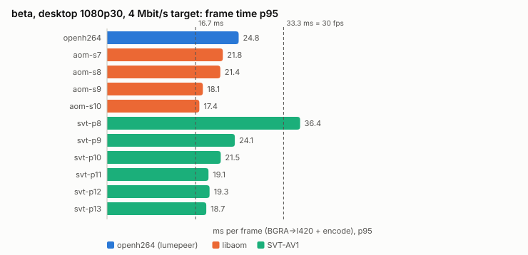
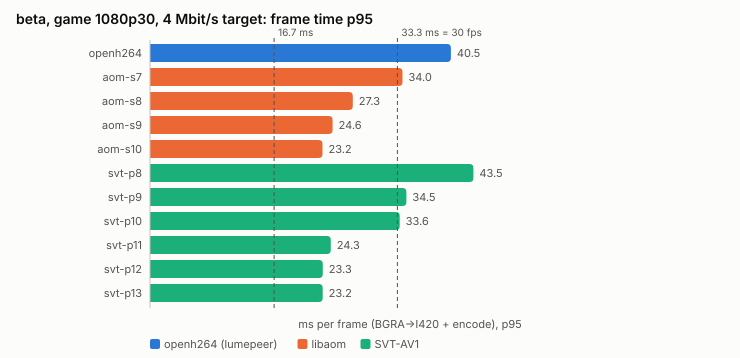
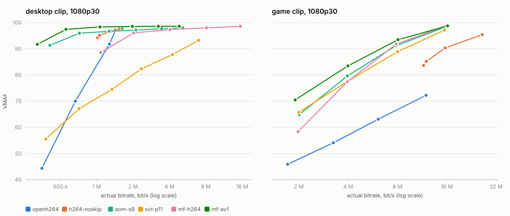
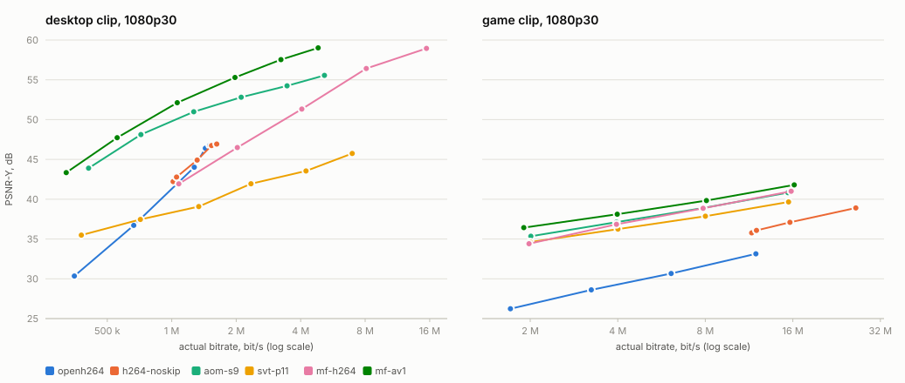
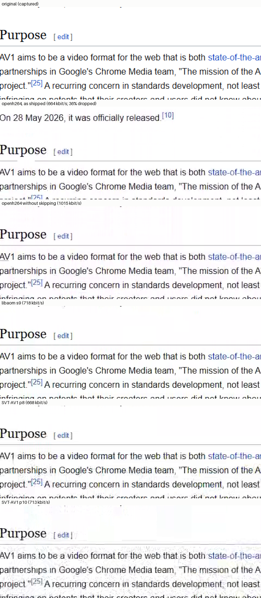
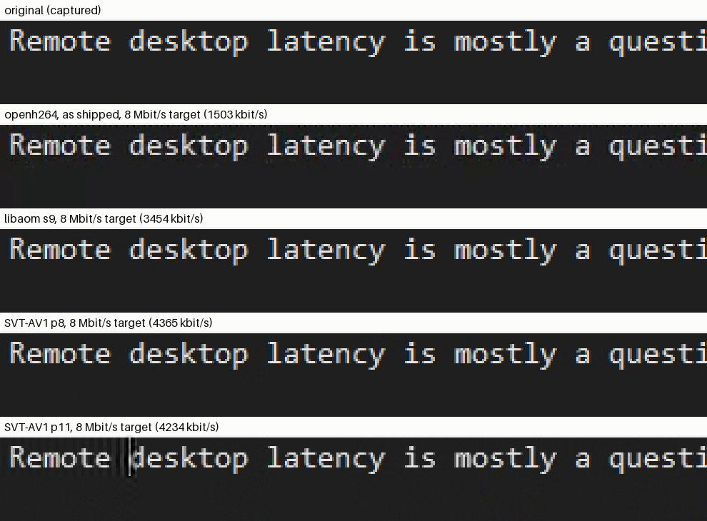

# Программный AV1 для хостов без аппаратного AV1-энкодера — этап 1 (замеры)

Дата: 2026-10-01. Ветка `research/software-av1`. Всё, что ниже, — замеры, кроме
мест, где прямо сказано «не проверено».

**Этап 2 (2026-10-02)** — libaom встроен в продукт по решению владельца:
раздел [«Этап 2: libaom в продукте»](#этап-2-libaom-в-продукте) в конце и
[ADR 0139](../adr/0139-a-host-with-no-hardware-encoder-encodes-av1-in-software.md).

## Итог

**Условие перехода к этапу 2 в строгом виде не выполнено, поэтому в продукт
ничего не встроено.** Ровно на одном пункте, времени кодирования, и с оговоркой,
которая, по-моему, меняет вывод (раздел «Пороги»).

| условие (beta, 1080p, рабочий стол, 30 fps) | порог | лучший кандидат: libaom realtime, speed 10 | openh264 в lumepeer сегодня | итог |
|---|---|---|---|---|
| время кадра p95 (BGRA→I420 + кодирование) | ≤ 16 мс | **15.8** при 2 Мбит/с; 17.4 при 4; 20.0 при 8 (пресет «качество»); без конвертации 12.9 / 14.6 / 16.8 | 24.8–26.7 | ✗ при 4–16 Мбит/с, на 1.4–4.6 мс |
| CPU | ≤ ~50% всех ядер | 1.1–1.2 ядра = **7%** от 16 потоков (игра: 2.3–3.2 ядра = 14–20%) | 0.6–0.7 ядра | ✓ |
| экономия битрейта при равном качестве — или заметно чётче текст | ≥ 25% | рабочий стол: **−61% PSNR-Y / −46% VMAF** против openh264 как есть; против openh264 без пропуска кадров −60% PSNR-Y, VMAF у потолка (−14%), на кропах чётче при битрейте на 30% ниже; игра: **−55% VMAF** | — | ✓ |
| декодирование AV1 1080p у гостя класса beta, p95 | ≤ ~10 мс | **на beta не измерено** (ушла из сети); на этом ПК программно p95 4.2 мс (рабочий стол) и 6.3 мс (игра) для потоков libaom | — | ? |

Что показали замеры, по важности:

1. **Главная беда хоста без аппаратного энкодера — не кодек, а то, как lumepeer
   настроил openh264.** Режим скорости `RateControlMode::Quality` с включённым
   пропуском кадров (умолчания крейта, lumepeer их не трогает) выбрасывает кадры:
   на игре при 8 Мбит/с (пресет «качество») — **237 из 600 (40%)**, гость видит ~18
   fps вместо 30; при 2 Мбит/с — 62%. На рабочем столе при цели 1 Мбит/с — 36%,
   прокрутка превращается в рывки (VMAF прокрутки 60). Без пропуска кадров
   openh264 физически не укладывается в битрейт: на игре цель 2 Мбит/с даёт
   **11.5 Мбит/с**, 8 — 15.6; и не успевает: p50 26–29 мс, p95 47–72 мс уже на
   i7-11800H. То есть на играх openh264 держит 30 fps сегодня *только* за счёт
   выброшенных кадров. Хорошей настройки у него нет.
2. **Программный AV1 на beta быстрее нынешнего openh264, а не медленнее**:
   libaom s9/s10 — p50 10 мс, p95 16–21 мс, p99 20–27 мс против 22 / 25–27 / 33–48
   у openh264 на рабочем столе; на игре кодирует **каждый** кадр с p95 22–28 мс
   (SVT p11–13 — 20–32 мс), там где openh264 выбрасывает 40%.
3. **По эффективности AV1 выигрывает много**: см. таблицы BD-rate ниже. На игре
   все AV1-энкодеры экономят 41–58% против openh264 без пропусков (по всем трём
   метрикам), на рабочем столе libaom даёт +6–7 дБ PSNR-Y при равном битрейте
   против openh264 без пропусков (+9–10 дБ против openh264 как есть).
4. **Из двух библиотек годится libaom, не SVT-AV1** (в версиях 3.15.1 и 4.2.0):
   у SVT-AV1 инструменты экранного контента работают только на пресетах ≤ 8, а
   пресет 8 на beta — p95 35–37 мс; быстрые пресеты 11–13 плохо кодируют
   прокрутку текста (VMAF прокрутки 11–86 на 0.4–9 Мбит/с, BD-rate +78…+95%
   *хуже* openh264); а его самый быстрый режим (rtc + flat IPP) **падает**
   (segfault), когда контроль битрейта доходит до QP 0 — см. «SVT-AV1: падение».
5. Аппаратный MF AV1 этого ПК (Intel UHD) — самый экономный из всех (−71% на
   рабочем столе), но медленный: 25 мс на кадр 1080p, 50 мс на 1440p; и один раз
   упал с access violation внутри кода lumepeer/драйвера (см. «Побочные находки»).

**Моя рекомендация владельцу:** пересмотреть порог по времени (обоснование
ниже), достроить недостающий замер декодирования на beta и, если он пройдёт,
делать этап 2 с **libaom realtime, speed 10** (speed 9 как вариант для машин
мощнее) для 1080p при 30 fps. SVT-AV1 и rav1e — нет.

## Результаты

### Время кодирования на beta (Ryzen 7 5700U), 1080p30, реальное время

Время кадра = конвертация BGRA→I420 (на beta 2.7 мс p50, 3.4 мс p95 — одинаково
для всех) + кодирование. Все числа — по 900 (рабочий стол) и 600 (игра) кадрам
каждого прогона; «ядер» — процессорное время на секунду видео.

| энкодер | рабочий стол p50 / p95 / p99, мс | ядер | игра p50 / p95 / p99, мс | ядер |
|---|---|---|---|---|
| openh264, lumepeer как есть | 22 / 25–27 / 33–48 | 0.6–0.7 | 5–12 / **31–67** / 51–87 | 0.3–0.7 |
| libaom s10 | 10–11 / 16–21 / 21–27 | 1.1–1.2 | 18–24 / 22–27 / 24–30 | 2.3–3.2 |
| libaom s9 | 10–11 / 16–20 / 20–23 | 1.1–1.2 | 18–24 / 22–28 / 24–30 | 2.3–3.2 |
| libaom s8 | 12 / 19–25 / 25–29 | 1.4–1.5 | 21–28 / 25–76 / 27–229 | 2.7–5.0 |
| SVT-AV1 p13 | 12 / 17–25 / 20–36 | 0.75 | 16–26 / 20–30 / 22–35 | 0.9–1.3 |
| SVT-AV1 p11 | 12 / 18–25 / 22–35 | 0.8 | 18–27 / 22–32 / 23–37 | 1.0–1.5 |
| SVT-AV1 p8 (с инструментами экранного контента) | 17–19 / **35–37** / 47–59 | 1.3–1.5 | 26–45 / 38–69 / 40–315 | 2.4–5.0 |

Разброс внутри ячейки — по битрейтам 2–16 Мбит/с (больше битрейт — дольше
кодирование). Полные таблицы по всем прогонам — `software-av1/tables.md`.

На этом ПК (i7-11800H) всё быстрее в ~1.6 раза: libaom s9/s10 на рабочем столе
p95 10–15 мс, SVT p11–13 p95 12–19 мс, openh264 p95 18 мс; аппаратный MF H.264 —
p50 10 мс при 0.18 ядра.

### Качество и BD-rate

BD-rate — сколько битрейта нужно энкодеру для того же качества, что у эталона
(минус = меньше). Эталонов два: openh264 **как в lumepeer** (с пропуском кадров —
то, что видит гость сегодня) и openh264 **без пропуска кадров** (что дала бы
перенастройка без смены кодека).

| энкодер | рабочий стол, против openh264 как есть: VMAF / PSNR-Y | рабочий стол, против openh264 без пропусков: VMAF / PSNR-Y / ΔPSNR при равном битрейте | игра, против openh264 без пропусков: VMAF / PSNR-Y / SSIM |
|---|---|---|---|
| libaom s8 | −51% / −66% | −25% / −66% / +6.9 дБ | −55% / −74% / −48% |
| libaom s9 | −50% / −64% | −19% / −64% / +6.2 дБ | −54% / −74% / −48% |
| libaom s10 | −46% / −61% | −14% / −60% / +5.9 дБ | −55% / −74% / −48% |
| SVT-AV1 p8 | −53% / −55% | −13% / −50% / +4.8 дБ | −58% / −78% / −53% |
| SVT-AV1 p10 | −30% / −12% | +58% / +25% / −1.3 дБ | −55% / −68% / −49% |
| SVT-AV1 p11 | **+78% / +88%** | хуже, кривые не пересекаются | −46% / −62% / −39% |
| SVT-AV1 p13 | **+95% / +184%** | хуже, кривые не пересекаются | −41% / −59% / −33% |
| MF H.264 (аппаратный) | +18% / +18% | +93% / +24% / −1.7 дБ | −55% / −72% / −50% |
| MF AV1 (аппаратный) | −71% / −70% | −63% / −70% / +8.3 дБ | −62% / −82% / −56% |
| openh264 без пропусков | −14% / −4% | — | — |

Как читать рабочий стол. Против openh264 как есть разница огромная, но это во
многом разница в выброшенных кадрах. Против openh264 без пропусков общий
диапазон VMAF — 94–97.7: на неподвижном тексте VMAF у потолка, и BD-rate по нему
и по SSIM (там расхождения в четвёртом знаке; у libaom вышло даже «+65…+87%»)
ничего не значит. PSNR-Y различает: libaom +6–7 дБ при равном битрейте. Поэтому
текст сравнивался на глаз — ниже.

На игре (CSGO) openh264 без пропусков вообще не опускается ниже ~11 Мбит/с, и
на его диапазоне 11–26 Мбит/с все AV1-энкодеры дают то же качество за 41–58%
битрейта. Против openh264 как есть BD-rate на игре −71…−82%, но там общий
диапазон качества узкий (VMAF до 72), число справочное.

### Текст: кропы

Прокрутка статьи Википедии, кадр 450, увеличение ×3 без сглаживания, около
0.7 Мбит/с (openh264 без пропусков ниже 1 Мбит/с не опускается):

- libaom s9 при 718 кбит/с ближе всех к оригиналу и чётче, чем openh264 при
  1015 кбит/с (у openh264 ещё артефакт прокрутки — призрачное подчёркивание под
  «AV»);
- SVT-AV1 p8 местами смазывает (вертикальные полосы у «AV1»), p10 — заметный шум
  вокруг букв;
- цветную окантовку ClearType теряют все: это 4:2:0, одинаково для H.264 и AV1.

Тот же кадр без увеличения, у openh264 как есть (664 кбит/с) — это **другой
кадр**: настоящий был выброшен, гость видит страницу на строку позади:

Неподвижный текст в редакторе при цели пресета «качество» (8 Мбит/с) у всех
практически одинаков; мелочи: у openh264 ряд точек над строкой, у SVT p11 —
«призрак» прежнего положения курсора:

### 1440p и 4K (только этот ПК)

Клипы с 4K-рабочего стола этого ПК (масштаб 250%): 1440p — уменьшенный, 4K —
исходный. На beta таких экранов нет; ниже — i7-11800H.

| энкодер | 1440p: p50 / p95, мс | 1440p: битрейт, VMAF, VMAF прокрутки (цель 8 Мбит/с) | 4K: p50 / p95, мс (цель 16) |
|---|---|---|---|
| openh264 как есть | 25 / **64–76** | 1468 кбит/с, 95.0, 93.9 | 52 / **79** |
| libaom s9 / s10 | 9 / 23–24 | 0.9–1.0 Мбит/с при любой цели, 93.0–93.1, **86** | 19 / 39 |
| libaom s8 | 13 / 25 | 3965 кбит/с, 93.7, 87.6 | 25 / 47 |
| SVT-AV1 p10 | 12 / 32 | 3396 кбит/с, 96.4, 95.0 | 31 / 68 |
| SVT-AV1 p11–13 | 12 / 21–25 | 3.4–3.5 Мбит/с, 89–90, 75–77 | 29–30 / 49–56 |
| MF H.264 | 19 / 25 | 7726 кбит/с, 96.9, 96.6 | 39 / 46 |
| MF AV1 | 51 / 76–119 | 5574 кбит/с, 96.9, 96.4 | 99 / 122 |

- openh264 и на этом ПК не держит 30 fps на 1440p (p95 64–76 мс) и на 4K.
- libaom realtime на 1440p при speed 9/10 почти не тратит биты на неподвижный и
  прокручиваемый экран (~0.9 Мбит/с при любой цели, прокрутка VMAF 86): у него
  потолок качества на прокрутке выше 1080p, которого нет на 1080p. Это нужно
  разбирать отдельно, если идти дальше 1080p.
- 4K программным AV1 в реальном времени не тянет даже этот ПК (p95 39 мс у
  libaom). Выше 1440p — только аппаратный энкодер или уменьшение картинки.

### SVT-AV1: падение

SVT-AV1 4.2.0 в режиме `rtc` с плоской структурой IPPP (`hierarchical-levels
0`, самый быстрый режим реального времени) падает с segfault, когда контроль
битрейта доходит до qindex 0 — режима lossless в AV1. На этом ПК: **каждый**
прогон рабочего стола 2560×1440 в первые секунды и один прогон 1080p из ~50
(игра, 16 Мбит/с). Не зависит от числа потоков, пресета 9–13, темпа подачи, GOP,
режима экранного контента; исчезает с `min-qp 1` (6 из 6 повторов без падения)
и с иерархией по умолчанию (2 уровня — но она медленнее: p95 19–32 мс вместо
12–20 на этом ПК). В итоговых замерах SVT-AV1 — flat IPP с `min-qp 1`. Это баг
библиотеки, о нём стоит сообщить в SVT-AV1 (воспроизведение — `tools/codec-bench`,
клип 1440p рабочего стола, `--encoder svt --speed 11 --minq 0`).

### Декодирование AV1 у гостя

Страница `tools/codec-bench/decode-bench.html` декодирует потоки из прогонов
через WebCodecs так же, как гость lumepeer (`{ codec: 'av01.0.05M.08',
optimizeForLatency: true }`, без указания аппаратного ускорения), двумя способами:
по одному кадру с ожиданием картинки («последовательно») и в темпе 30 fps («в
реальном времени» — задержка от `decode()` до картинки, с очередью). Первый кадр
(запуск декодера) из процентилей исключён.

**beta — не измерено.** Пакет для замера (headless Edge с отдельным профилем,
`run-decode.ps1`) на beta скопирован, но запуск через планировщик не стартовал
Edge, а пока я разбирался, beta ушла из сети и не вернулась (Tailscale: offline
5 ч; Mac и debian — тоже). У beta (Vega 8, VCN 2.0) нет аппаратного AV1-декодера,
так что WebView2 декодирует программно (dav1d).

**Этот ПК** (Chrome 154 headless, тот же движок, что WebView2 154; i7-11800H),
в реальном времени, мс на кадр:

| поток | аппаратно (по умолчанию) p50 / p95 | программно (dav1d) p50 / p95 / p99 |
|---|---|---|
| рабочий стол 1080p, libaom s9, 4 Мбит/с | 0.5 / 1.4 | 1.6 / 4.2 / 5.8 |
| рабочий стол 1080p, SVT p11, 4 Мбит/с | 0.5 / 0.9 | 1.6 / 5.9 / 11.4 |
| игра 1080p, libaom s9, 8 Мбит/с | 0.6 / 1.5 | 3.4 / 6.3 / 8.1 |
| игра 1080p, SVT p11, 8 Мбит/с | 0.6 / 1.5 | 5.8 / **17.5** / 20.1 |
| рабочий стол 1440p, SVT p11, 8 Мбит/с | 0.6 / 1.7 | 1.7 / 6.5 / 16.9 |
| рабочий стол 4K, SVT p11, 16 Мбит/с | 0.7 / 1.9 | 6.9 / 18.6 / 30.4 |

Потоки libaom декодируются заметно дешевле потоков SVT-AV1 (на игре p95 6.3
против 17.5 мс). Если beta медленнее этого ПК во столько же раз, во сколько
медленнее кодирует (~1.6), то программное декодирование 1080p потока libaom на
ней — p95 ~7–10 мс, около порога; **это предположение, его надо измерить**.

Mac (WKWebView на Intel — нет аппаратного AV1) и Raspberry Pi: не проверены,
машины вне сети; для Mac готов `tools/codec-bench/decode-webkit-mac.swift`.

## Пороги

- **CPU ≤ 50% всех ядер** — слишком мягкий порог. На ноутбуке за 15 Вт половина
  ядер — это троттлинг и чужие кадры в играх у пользователя хоста. Разумнее
  «не больше двух ядер при 1080p30»: libaom s9/s10 укладывается (1.1–1.2 ядра на
  рабочем столе; на игре 2.3–3.2 — больше, и это надо держать в уме), SVT p11–13
  тоже (0.8 и 1.0–1.5).
- **p95 ≤ 16 мс (половина интервала кадра при 30 fps)** — я считаю его неверно
  выбранным эталоном. Он абсолютный, а сравнивать надо с тем, что хост делает
  сейчас: openh264 на beta — p95 25–27 мс и p99 до 48 мс, и при этом на играх
  выбрасывает 40% кадров. libaom s10 — p95 17.4–20.6 мс при 4–16 Мбит/с, p99
  21–27 мс, и кодирует каждый кадр. Переход на него *уменьшает* задержку на beta
  на 6–10 мс по p95 и на 7–24 мс по p99 при той же цели битрейта. Предлагаю порог: p95 не больше, чем у
  openh264 на той же машине, **и** не больше 2/3 интервала кадра (22 мс при 30
  fps) — запас под захват и отправку. Под ним libaom s10 проходит на всех
  битрейтах, SVT p11–13 — до 8 Мбит/с.
- Отдельно: из этих ~20 мс 2.7–3.4 мс — конвертация BGRA→I420 скалярным кодом
  крейта openh264, общая для всех кодеков. SIMD-конвертация (или на GPU) вернёт
  эти миллисекунды и openh264 тоже.
- **≥ 25% экономии** — порог нормальный; AV1 его проходит с запасом на игре и по
  PSNR на рабочем столе. Но на тексте VMAF и SSIM у потолка, поэтому для
  рабочего стола решать надо по PSNR и кропам, а не по VMAF.
- **60 fps** («баланс») и 144 («производительность»): на beta при 1080p не
  успевает никто из программных — ни openh264, ни AV1. Программный AV1 — только
  для пресета «качество» (30 fps).

## Побочные находки

- **lumepeer MF AV1 упал один раз** (0xC0000005, access violation) на этом ПК:
  рабочий стол, 500 кбит/с, полный прогон 900 кадров в реальном времени. Шесть
  повторов прошли. Это код, который уже работает у пользователей с аппаратным
  AV1 (`encode/windows.rs` + MFT Intel), его стоит разобрать отдельно.
- **Локальные сборки openh264 без ассемблера.** `openh264-sys2` молча собирается
  без SIMD, если не находит `nasm` (на этом ПК его не было): p50 54 мс, p95 150 мс
  на кадр 1080p вместо 14 / 18. Релизная сборка Windows (v0.0.118) ассемблер
  содержит — проверено поиском машинного кода в `lumepeer-desktop.exe`
  (`tools/codec-bench/find-openh264-asm.py`: 25 из 31 фрагмента; сборка с
  ассемблером — 31/31, без — 0/31). Linux/macOS-релизы не проверены.
- **Строка кодека AV1 у гостя** `av01.0.05M.08` означает уровень 3.1, а
  комментарий рядом в `view-decoder.ts` говорит про 4.1 (это `av01.0.09M.08`).
  Chromium уровень почти не проверяет, но для 1440p/4K 3.1 формально мало.
- rav1e 0.8.1 на speed 10 (пробный синтетический клип `testsrc2` 1080p): >200 мс
  на кадр и перерасход битрейта ×3 в low-latency — для реального времени не
  подходит, на реальных клипах не мерился.

## Что не проверено

- Декодирование AV1 на beta, Mac (WKWebView, Intel) и Raspberry Pi — машины были
  вне сети (см. «Декодирование»).
- Кодирование на Mac, Pi и в Linux (WSL/debian): не мерилось.
- 60 fps и динамическая смена битрейта (ABR) — все прогоны при фиксированной цели.
- Живая сессия lumepeer с программным AV1 — это этап 2.

## Как мерили

### Материал

Записи экрана без потерь, без курсора (гость lumepeer рисует курсор сам):

| клип | откуда | размер | кадры | что внутри |
|---|---|---|---|---|
| desktop 1080p | реальный рабочий стол **beta** (1920×1080, масштаб 100%), Desktop Duplication через `ffmpeg ddagrab`, BGRA без сжатия | 1920×1080 | 900 (30 с при 30 fps) | 0–300: набор текста в редакторе (тёмная тема, Consolas 11); 300–600: прокрутка статьи Википедии про AV1 в Edge; 600–900: перетаскивание окна Edge поверх рабочего стола и окна VMware |
| game 1080p | Xiph `derf/twitch/CSGO` (y4m 1080p60, public domain), каждый второй кадр | 1920×1080 | 600 (20 с при 30 fps) | быстрый шутер от первого лица, текстуры, HUD |
| desktop 1440p | рабочий стол этого ПК (3840×2160, масштаб 250%), тот же сценарий, уменьшен в 1.5 раза фильтром `area` — так lumepeer уменьшает картинку хоста под окно гостя | 2560×1440 | 875 | те же три сегмента |
| desktop 4K | та же запись без уменьшения, с сегмента прокрутки | 3840×2160 | 575 | прокрутка + перетаскивание |

Сценарий — `tools/codec-bench/record-desktop.ps1`. Набор текста делает само окно
редактора (по таймеру добавляет символ раз в ~110 мс): Блокнот Windows 11
игнорирует синтетические нажатия (`SendInput` возвращает успех, символ не
появляется), а `SendKeys` из PowerShell 5 работает через journal hook, который
Windows 11 запрещает. Картинка на экране от этого не отличается от набора руками.
4K записан в `libx264rgb -qp 0` (математически без потерь): несжатый 4K30 — это
~1 ГБ/с, диск этого ПК пишет ~400 МБ/с.

Сырые клипы (8–19 ГБ каждый) лежат вне репозитория:
`C:\Users\beta_win\av1-research\clips`.

### Энкодеры и настройки

Все программные энкодеры собраны из исходников с ассемблером (nasm 3.01) — так,
как их пришлось бы собирать в продукт. Настройки — максимально близко к тому, как
кодирует lumepeer: один проход, без lookahead и B-кадров, ключевой кадр только
первый, CBR, один кадр на входе — один пакет на выходе.

| имя в таблицах | что это | настройки |
|---|---|---|
| `openh264` | **эталон**: код lumepeer, `lumepeer_media::encode::software::OpenH264Encoder` (openh264 0.9.8), BGRA на входе, его собственная конвертация в I420 | как в продукте: `ScreenContentRealTime`, `Complexity::Low`, потоков min(ядер, 4), `RateControlMode::Quality` (умолчание крейта), пропуск кадров включён (умолчание) |
| `openh264-noasm` | тот же код, openh264 собран без ассемблера | см. «Побочные находки» |
| `aom-s7`…`aom-s10` | libaom 3.15.1, `AOM_USAGE_REALTIME`, `cpu-used` 7–10 | настройки RTC из WebRTC (`libaom_av1_encoder.cc`): CBR, буфер 600/600/1000 мс, under/overshoot 50%, AQ 3 (cyclic refresh), CDEF, без TPL/order hint/OBMC/warped/global motion, `max-intra-bitrate-pct 300`; 8 потоков, 4 колонки тайлов, row-mt; для рабочего стола `tune-content=screen` + palette |
| `svt-p7`…`svt-p13` | SVT-AV1 4.2.0, режим `rtc` | low delay (`pred-struct 1`), иерархия по умолчанию библиотеки (2 уровня — см. «SVT-AV1: падение»), CBR, буфер 600/600/1000 мс, lookahead 0, без TF и scene change, `lp 0` (потоки — авто); для рабочего стола `scm 1` (работает только на пресетах ≤ 8 — см. ниже) |
| `mf-h264`, `mf-av1` | аппаратные энкодеры этого ПК через код lumepeer (`MediaFoundationEncoder`) | как в продукте; только как ориентир |
| rav1e 0.8.1 | speed 10, low latency | только справочно: на пробном синтетическом клипе (`testsrc2` 1080p) >200 мс на кадр, дальше не мерили |

Диапазон QP у всех AV1-энкодеров открыт полностью (0–63), как у openh264
(0–51): ограничение WebRTC `min-qp 10` не давало AV1 тратить больше ~2 Мбит/с на
рабочем столе, и кривые качества обрывались.

Все программные энкодеры получают одинаковые пиксели: BGRA → I420 тем же
конвертером, что у openh264 в lumepeer (`YUVBuffer::from_bgra8_source`, BT.601
limited). MF получает тот же I420, переложенный в NV12. Время конвертации входит
во «время кадра» у всех (у openh264 оно внутри его обёртки, как в продукте).

### Что меряет стенд

`tools/codec-bench` — отдельный Rust-проект вне workspace lumepeer. Кадры клипа
подаются **в реальном времени** (30 fps), чтение с диска — в отдельном потоке
наперёд, вне замера. На каждый кадр:

- **время кадра** = конвертация + `encode()` до готового пакета; p50/p95/p99/max
  по всем кадрам клипа, первый (ключевой) кадр — отдельно;
- **CPU** = процессорное время процесса за прогон минус время потока чтения,
  делённое на длительность прогона: «ядер занято» и «% от всех логических ядер»;
- размер каждого пакета, пропущенные кадры (openh264 пропускает их сам).

Качество (`tools/codec-bench/metrics.py`): битстрим декодируется ffmpeg
(dav1d для AV1), кадры выравниваются по исходным — пропущенный энкодером кадр
считается повтором предыдущего, как его и видит гость, — и сравниваются с тем
I420, который энкодеры получили на вход: VMAF 0.6.1 (среднее и 5% худших кадров),
PSNR-Y, SSIM. BD-rate — по Бьёнтегаарду (VCEG-M33): log-битрейт как кубика от
качества по огибающей точек, среднее по общему диапазону качества. Битрейт везде
**фактический**, а не заданный.

Энкодеры детерминированы: openh264 на этом ПК и на beta дал побайтно одинаковые
потоки, поэтому качество посчитано один раз по потокам этого ПК, а время и CPU
мерились на каждой машине.

### Машины

| машина | CPU | роль |
|---|---|---|
| этот ПК | Intel i7-11800H, 8 ядер / 16 потоков, Windows 11 | качество, 1440p/4K, MF |
| **beta** | AMD Ryzen 7 5700U (Zen 2, 15 Вт), 8/16, Windows 11, без аппаратного энкодера в lumepeer | главная цель |

Обе виртуальные машины на beta (Debian, macOS) на время замеров были
приостановлены через `vmrun suspend` (фон до этого — 15–20% CPU; после — 1–4%).
Возобновить их надо, когда beta вернётся в сеть: `vm-control.ps1 -Action resume`
в `C:\Users\bberb\AppData\Local\Temp\av1rec` (пока не сделано). Во время второй
серии замеров beta один раз перезагрузилась сама (часы при загрузке ушли на 3 ч
назад); серия к тому моменту уже закончилась.

## Как повторить

Всё лежит в `tools/codec-bench` (отдельный Cargo-проект, в workspace не входит):

1. nasm на PATH; libaom 3.15.1 и SVT-AV1 4.2.0 собрать из исходников статически
   (cmake, MSVC, `/MD`); пути — переменные `AOM_INCLUDE`, `AOM_LIB_DIR`,
   `SVT_INCLUDE`, `SVT_LIB_DIR` (см. `build.rs`).
2. `cargo build --release --features mf` — стенд со всеми энкодерами;
   openh264 «как в сборке без nasm» — `OPENH264_NO_ASM=1 cargo build --release
   --no-default-features` в отдельный `CARGO_TARGET_DIR`.
3. `record-desktop.ps1 [-Output x264rgb] [-Browser chrome.exe]` — запись клипа в
   интерактивной сессии Windows-хоста.
4. `matrix.py --machine pc --clip desktop --clips <папка> --out runs-pc --run` —
   прогоны здесь; `--emit cmd` / `--emit sh` — скрипт для другой машины.
5. `codec-bench ref …` — эталонный I420; `metrics.py` — VMAF/PSNR/SSIM;
   `report.py` — таблицы (`software-av1/tables.md`) и графики; `crops.py` — кропы.
6. Декодирование: `make-decode-data.py` → `decode-bench.html` в браузере,
   `run-decode.ps1` (headless Edge), `decode-webkit-mac.swift` (WKWebView).
7. `find-openh264-asm.py <out-dir openh264-sys2 со сборки с nasm> <exe>` — есть
   ли в бинарнике ассемблер openh264.

Сырые клипы, потоки и логи этого исследования лежат вне репозитория, в
`C:\Users\beta_win\av1-research`: `clips/`, `runs-pc/`, `runs-beta-final/` (beta:
openh264 и libaom из первой серии, SVT-AV1 из повторной), `runs-pc-flatipp/`
(SVT-AV1 с `min-qp 0`, с падениями), `runs-pc-svth2/` (SVT-AV1 с иерархией по
умолчанию), `refs/`, `crops/`, `decode/`.

## Этап 2: libaom в продукте

Дата: 2026-10-02. Решение и условия — [ADR 0139](../adr/0139-a-host-with-no-hardware-encoder-encodes-av1-in-software.md);
здесь — что сделано, что проверено и чем, и что осталось.

**Где делался этап 2.** Не на этом ПК и не на beta: в облачном Linux-контейнере
(Intel Xeon @ 2.80 GHz, 4 vCPU без SMT, Ubuntu 24.04). Tailscale там нет, beta
недоступна, сырых клипов (`C:\Users\beta_win\av1-research`) нет, Windows нет.
Поэтому всё, что требует beta, клипов или живой пары окон, не сделано — ниже
сказано, что именно и как это доделать.

### Что встроено

- `crates/aom-sys` (`lumepeer-aom-sys`): libaom **3.15.1** — тот же релиз, что
  мерился на этапе 1, — из официального tarball (SHA-256 в `VENDORED.md`),
  без тестов, документации, приложений и чужого кода, нужного только им.
  Собирается из исходников `cmake`-ом, статически, realtime-only, только
  энкодер. **Без nasm сборка падает** с объяснением; после configure
  проверяется, что в `aom_config.h` есть x86-64, SSE2…AVX2 и runtime CPU
  detection. C-шим — шим этапа 1, плюс `aom_shim_set_bitrate`
  (`aom_codec_enc_config_set`) и ошибки в буфер вместо stderr.
- `lumepeer-media`, фича `encode-aom` (по образцу `encode-openh264`, только
  x86-64 Windows/Linux, на остальных целях инертна): `encode::aom::AomEncoder`
  (`VideoEncoder`; пиксели через `Frame::as_cpu`; `request_keyframe`;
  `set_bitrate` без пересоздания энкодера и без ключевого кадра; размер
  меняется — новый энкодер с ключевого кадра) и `encode::software_av1` —
  готовность хоста и само измерение. `select_encoder` строит libaom для AV1
  без аппаратного AV1, если он собран и процессор с AVX2.
- `lumepeer-runtime`: `choose_media_codec` — условия ADR 0139; при смене
  пресета кодек выбирается заново, и если ответ изменился, медиапоток
  перезапускается (гость переподключает его сам, ~0.5 с «переподключения»);
  encode loop держит программный AV1 на 30 fps, заканчивает поток на кадре
  больше 1080p и следит за p95 (два окна по 90 кадров дольше 33 мс — AV1 off
  до перезапуска lumepeer).
- Строка кодека у гостя: `av01.0.09M.08` (уровень 4.1) вместо `av01.0.05M.08`
  (3.1).
- Релиз: `encode-aom` только в `windows-amd64` и `linux-amd64`; nasm ставится в
  обе строки; после сборки `ci/find-libaom-asm.py` ищет машинный код,
  собранный nasm, в `lumepeer-desktop(.exe)`. Лицензия libaom (BSD-2 +
  AOMedia Patent License 1.0) — в `deny.toml` рядом с openh264 и в `license`
  крейта (SBOM). Побочно: в Linux-строке релиза nasm не было никогда, т. е.
  **openh264 в Linux-релизах до сих пор собирался без ассемблера**; теперь — с
  ним.

### Цель битрейта и порог в продукте

- libaom получает **половину** H.264-цели сессии: «качество» 8 Мбит/с →
  4 Мбит/с AV1. Половина лежит внутри всех BD-rate этапа 1 (−46% VMAF / −61%
  PSNR-Y на рабочем столе, −55% на игре) и быстрее: на beta p95 17.4 мс вместо
  20.0 на рабочем столе и 23.2 вместо 25.2 на игре.
- Порог владельца (p95 ≤ openh264 на той же машине **и** ≤ 22 мс) хост
  проверяет сам, один раз за процесс, когда приходит первый гость, умеющий
  AV1: путь продукта (BGRA→I420 + libaom с настройками сессии) против
  openh264 продукта на синтетическом 1080p-«рабочем столе» в трёх актах
  записи этапа 1 — набор строки, прокрутка страницы, перетаскивание окна, —
  по 30 кадров на акт, в темпе 30 fps; ~6 с. Хост с аппаратным H.264 не
  мерится вовсе.

### Проверка

**Тот же поток, что у шима этапа 1.** Синтетический клип 1920×1080, 300 кадров
(100 — набор строки, 100 — прокрутка текста по 8 px/кадр, 100 — перетаскивание
окна с текстом), текст — отрендеренный шрифт DejaVu Sans Mono 15 px. Стенд
`codec-bench` собран дважды на **одной и той же** сборке libaom (той, что
строит `lumepeer-aom-sys`): `aom` (шим этапа 1, `--speed 10 --threads 4 --tiles 2
--minq 0 --maxq 63 --screen 1`) и новый `lumepeer-aom` (энкодер продукта как
есть). Продукт при цели сессии 2T даёт **побайтно тот же поток**, что `aom-s10`
при T:

| | `aom-s10` @ T | `lumepeer-aom` @ 2T | md5 |
|---|---|---|---|
| T = 2000 | 874.8 кбит/с | 874.8 кбит/с | совпадает (`14a86190…`) |
| T = 4000 | 937.3 кбит/с | 937.3 кбит/с | совпадает (`7c1438a3…`) |

Урезанная копия libaom и полный релиз (оба realtime-only) тоже дают побайтно
одинаковый поток. Realtime-only и полная сборка — **не** одинаковый (разница
0.6% в размере): какой из двух собирал этап 1, в отчёте не записано; продукт
собирает realtime-only, как WebRTC/Chrome.

**Время, эта VM** (p50 / p95 / p99 кадра, мс; 300 кадров в реальном времени;
разброс — по двум-трём повторам):

| энкодер | цель | факт. кбит/с | p50 | p95 | p99 | ядер |
|---|---|---|---|---|---|---|
| `aom-s10` (шим этапа 1) | 4000 | 937 | 13.7–14.4 | 24.6–25.5 | 29–32 | 1.03–1.06 |
| `lumepeer-aom` (продукт) | 8000 (→ 4000) | 937 | 14.0–15.7 | 24.0–28.4 | 28–35 | 1.04–1.09 |
| openh264 продукта | 8000 | 810 | 25–26 | 36.1–39.6 | 44–45 | 0.74–0.76 |

По актам (`lumepeer-aom` @ 8000 / openh264 @ 8000, p50 / p95): набор 9.8 / 14.2
против 16.6 / 22.0; прокрутка 15.1 / 22.2 против 25.8 / 31.1; перетаскивание
23.4 / 29.4 против 33.1 / 46.8.

Продукт и шим в пределах шума друг друга, как и должно быть при одинаковом
потоке. Отношение этой VM к beta на рабочем столе одинаково для обоих
энкодеров: AV1 ~25 / 17.4 ≈ 1.45, openh264 ~38 / 25.9 ≈ 1.47 — синтетический
клип по тяжести близок к записанному, а VM примерно в 1.45 раза медленнее beta.

**Измерение продукта на этой VM** (`measures_this_host`, итоговая версия, три
прогона): AV1 p95 21.7 / 22.3 / 22.4 мс, openh264 45.3–53.1 мс → «готов» в
одном прогоне из трёх. Оно мягче отрендеренного клипа на 2–4 мс (24–28 мс):
мой синтетический текст проще шрифта. Первая версия измерения (только
прокрутка) давала 17.3 мс — на 8–10 мс мягче; поэтому измерение переделано на
три акта. Остаток расхождения записан в ADR 0139 как открытый вопрос.

**Тесты.** `lumepeer-media` (`encode::aom`, `encode::software_av1`,
`select_encoder`), `lumepeer-runtime`: каждая ветка `choose_media_codec` /
`software_av1_refusal` (нет AV1 у гостя; аппаратный AV1; каждая причина отказа
хоста; 30 / 31 / 60 / 144 fps; 1920×1080, 1080×1920, 1920×1200, 1440p, 4K;
пресет и размер ещё неизвестны), сторож encode loop; и сквозной тест с
настоящим libaom: хост и гость-актёры в одном процессе, гость умеет AV1 —
поток AV1 с ключевым кадром и sequence header на «качестве», на 60 fps поток
перезапускается в H.264, обратно на 30 — снова AV1. Плюс `error_matrix` и
`view-decoder.test.ts`. clippy `-D warnings` чист для `lumepeer-core`,
`lumepeer-aom-sys`, `lumepeer-media` (без фич, `capture-x11,encode-openh264`,
вся Linux-сборка с `encode-aom`) и `lumepeer-runtime` (с `encode-aom` и без).
Сборка без nasm падает (`NASM=/nonexistent/nasm` → «nasm not found …»);
`ci/find-libaom-asm.py` находит код всех шести обязательных объектов nasm в
бинарнике с libaom и ни одного — в бинарнике без него. Полные прогоны:
`lumepeer-core` 166/166, `lumepeer-media` 91/91 (с `encode-aom` — 104/104),
`error_matrix` 17/17, `media_pipeline` 7/7, `lumepeer-runtime` 310 из 312
(с `encode-aom` — 311 из 313): два терминальных теста
(`a_granted_shell_runs_and_a_revoke_closes_it_and_refuses_the_next`,
`a_closed_window_beside_ends_its_shells_and_not_the_session`) в этом
контейнере падают и на чистом master — шелл не открывается; к этапу 2
отношения не имеют.

**Оверлей статистики гостя** (Ctrl+Alt+Shift+S) показывает кодек (`AV1`), fps
и время *декодирования*; время *кодирования* — на хосте, в логе: каждые 90
кадров программного AV1 — «software AV1 frame time (scale and encode, p95)»,
каждые 5 с — «media: the last period of the encode loop» с `encode_ms`
(среднее/макс.). Протокола, который нёс бы его гостю, нет.

### Не сделано и почему

- **beta** (шаг 1): из облака её не видно (нет Tailscale). Не возобновлены VM
  (`vm-control.ps1 -Action resume`), **не измерено декодирование** — оно
  остаётся условием для включения в master — и не выяснено, почему lumepeer не
  видит на beta аппаратный H.264. Что проверить, по коду (не проверено):
  пробник H.264 договаривается с MFT на 64×64 (`PROBE_WIDTH`), а у
  AV1/HEVC-MFT Intel уже находился нижний предел размера (ADR 0069/0071) —
  может оказаться, что и у `AMDh264Encoder` он выше 64; MFT AMD
  регистрируется драйвером AMD, и с драйвером из Windows Update или «Basic
  Display Adapter» его может не быть; если хост на beta работает как агент
  сеанса (ADR 0085), аппаратные MFT в его контексте могут не перечисляться.
  Первым делом — `RUST_LOG=lumepeer_media=debug` на хосте beta (что вернул
  `MFTEnumEx` и на чём упала активация) и
  `ffmpeg -f lavfi -i testsrc2=s=1920x1080 -c:v h264_mf -hw_encoding 1 -frames 30 out.mp4`.
- **Клипы этапа 1**: прогон `lumepeer-aom` на записанном рабочем столе 1080p
  против `aom-s10` из отчёта — на машине с клипами:
  `cargo build --release --no-default-features --features lumepeer-aom` в
  `tools/codec-bench` (бинарник — `codec-bench-lumepeer`), затем
  `matrix.py --machine pc --clip desktop --only lumepeer-aom,aom-s10 --clips <папка> --bin-lumepeer <он> --run`.
  `lumepeer-aom-<T>` и `aom-s10-<T>` должны совпасть побайтно, если этап 1
  собирал libaom realtime-only, и по времени — в любом случае.
- **Живая пара на Windows** (хост без `encode-mf`, гость — второй экземпляр) и
  на beta: нет Windows и нет экрана. Её заменяет сквозной тест выше, но
  настоящего окна, показавшего AV1 от этого хоста, ещё не было.

### Пороги: стоп-условие

На **этой VM** путь продукта на «рабочем столе» в порог не укладывается:
p95 24–28 мс > 22 мс (при этом в 1.4–1.6 раза быстрее openh264, 36–40 мс). Это
4 облачных ядра, в ~1.45 раза медленнее beta; по правилу владельца такой хост
должен получать H.264. Измерение продукта на ней даёт 21.7–22.4 мс и
пропускает её примерно в одном случае из трёх — то есть пограничную машину
гейт ловит не всегда. На beta, по пересчёту этого же отношения, ожидается
p95 ≈ 17 мс в измерении и 17.4 мс на записанном столе (этап 1) — в пороге, но
**на beta путь продукта не мерился**.
